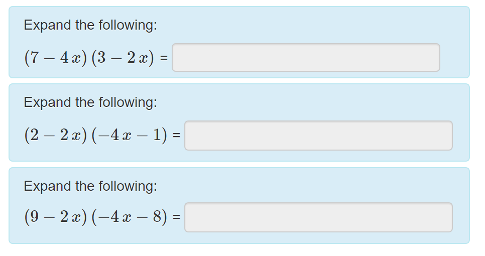
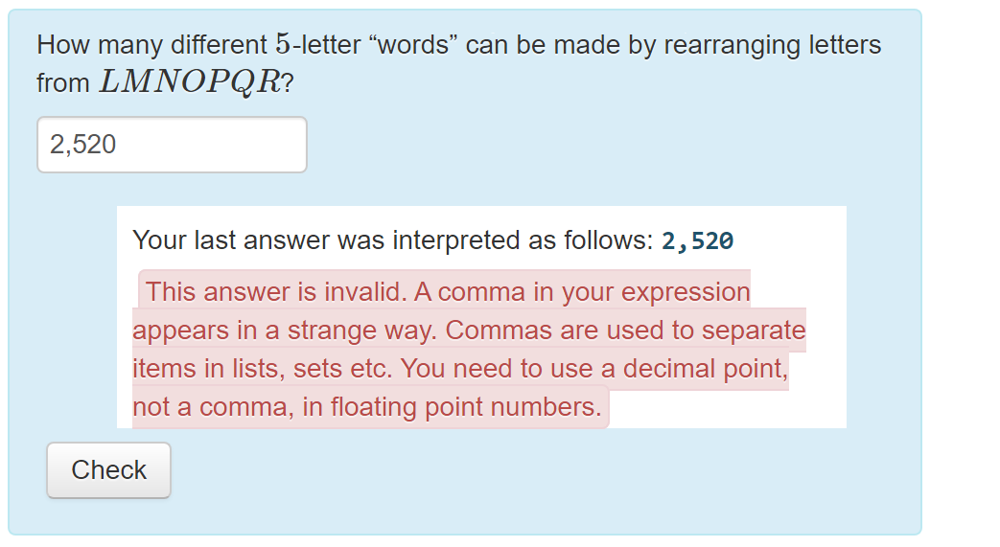

# About the STACK Project

STACK is an assessment system for mathematics, science and related disciplines, designed to enable students to answer questions with a mathematical expression, such as a polynomial. Students are not limited to multiple choice.

Primarily, STACK provides a question type for the [Moodle](https://github.com/maths/moodle-qtype_stack) and [ILIAS](https://github.com/ilifau/assStackQuestion/) learning environments. STACK can be integrated into other systems using [LTI](../Installation/LTI.md).

To see STACK in action, please visit our <button type="button" href="https://stack.maths.ed.ac.uk/demo" class="btn btn-primary">Demonstration site</button>.

## Main Features

### Intelligent randomisation

Randomising questions is invaluable in ensuring students can practice and reducing sharing of answers. The trick is to reverse-engineer the randomised question from a randomised answer. Computer algebra is invaluable to support this process.

### Validation of answers

Online assessment should assess mathematics skills, not how well students know the specific syntax. For example, penalising a student for answering `sinx` instead of `sin(x)` is not fair. 

  

    Separating validity from assessment is a key design feature pioneered by STACK.
  

To ensure that students are marked for *mathematical skills* instead of *computer skills*, STACK separates "validity" and "correctness". When a student types an answer, it is interpreted by the CAS and a "validation box" is shown displaying how the student's answer is interpreted. This gives the student a chance to fix any syntax errors before their answer is marked.

### Intelligent marking

STACK uses a Computer Algebra System to mark responses based on mathematical properties, rather than a single "correct" answer. This is invaluable in mathematics, where many expressions, such as \((x-1)(x+1)\) and \(x^2-1\), may be considered equivalent.

  

    Responses are marked based on mathematical properties, rather than a single "correct" answer.
  

In STACK, answers are marked using a potential response tree with multiple nodes. At each node, the teacher can check various mathematical properties of the student's answer, and can can choose to show feedback or change a student's grade. This opens up a whole array of options:

* Automatic feedback that is specific to the individual student.
* Partial credit.
* Multipart questions with follow-through marking, for example where a mistake in part (a) is carried forward into part (b).
* Give-examples style questions, where there are many correct answers.

### Supports real STEM questions

STACK has a large number of inputs and answer tests to support the diverse needs of users across mathematics and science. This includes support for questions about numerical accuracy, significant figures and scientific units. You can also assess student's ability to reason line-by-line through equivalence reasoning.

To learn more about all of STACKs features, please see our documentation.

## Who uses STACK?

STACK is used at a number of universities and institutions for online assessment. Some examples are:

- The University of Edinburgh, Loughborough University, The UK Open Universities and Aalto University use STACK on a large scale for their Maths and STEM courses,
- Physics Curriculum & Instruction uses STACK questions to accompany their Physics textbook,
- At Ruhr-Universität Bochum, STACK is being used for adaptive exercises that guide students through complex tasks.

You can read more about how these institutions use STACK by reading our [Case Studies](CaseStudies/2019/index.md).

## Development

STACK is currently being developed by

  

  
      <h5>Chris Sangwin</h5>
  The University of Edinburgh, UK
  

  

  
  <h5>Tim Hunt</h5>
  The Open University, UK
  

  

  
  <h5>Matti Harjula</h5>
  Aalto University, Finland
  

See the full list of contributors in our documentation. 

STACK is open-source and welcomes additions and improvements from its users. Please see the community page on our documentation for more information on contributing to STACK. Contributions can include adding features, submitting translations, sharing publications or reporting bugs.
