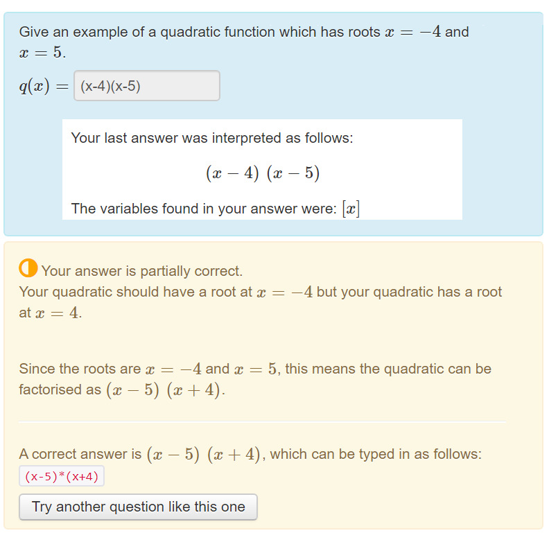

# About the STACK Project
<!-- ALL-CONTRIBUTORS-BADGE:START - Do not remove or modify this section -->

<!-- ALL-CONTRIBUTORS-BADGE:END -->
<!-- ALL-CONTRIBUTORS-BADGE:START - Do not remove or modify this section -->

<!-- ALL-CONTRIBUTORS-BADGE:END -->

STACK is an assessment system for mathematics, science and related disciplines, designed to enable students to answer questions with a mathematical expression, such as a polynomial. Students are not limited to multiple choice.

Primarily, STACK provides a question type for the [Moodle](https://github.com/maths/moodle-qtype_stack) and [ILIAS](https://github.com/ilifau/assStackQuestion/) learning environments. STACK can be integrated into other systems using [LTI](../Installation/LTI.md).

To see STACK in action, please visit our demonstration site.
 
 
<button type="button" href="https://stack.maths.ed.ac.uk/demo" class="btn btn-primary">Go to demo site</button>

## Main Features

<figure class="figure">

  <figcaption class="figure-caption">A typical STACK question. The two roots are randomly generated when the question is viewed. Note the student can see how their answer is interpreted, the feedback is specific to the student's error and partial marks are given.</figcaption>
</figure>

<h3> Intelligent randomisation</h3>

Randomising questions is invaluable in ensuring students can practice and reducing sharing of answers. The trick is to reverse-engineer the randomised question from a randomised answer. Computer algebra is invaluable to support this process.

### Validation of answers

Online assessment should assess mathematics skills, not how well students know the specific syntax. For example, penalising a student for answering `sinx` instead of `sin(x)` is not fair. 

 Separating validity from assessment is a key design feature pioneered by STACK.

To ensure that students are marked for *mathematical skills* instead of *computer skills*, STACK separates "validity" and "correctness". When a student types an answer, it is interpreted by the CAS and a "validation box" is shown displaying how the student's answer is interpreted. This gives the student a chance to fix any syntax errors before their answer is marked.
### Intelligent marking

STACK uses a Computer Algebra System to mark responses based on mathematical properties, rather than a single "correct" answer. This is invaluable in mathematics, where many expressions, such as \((x-1)(x+1)\) and \(x^2-1\), may be considered equivalent.

 Responses are marked based on mathematical properties, rather than a single "correct" answer.

In STACK, answers are marked using a potential response tree with multiple nodes. At each node, the teacher can check various mathematical properties of the student's answer, and can can choose to show feedback or change a student's grade. This opens up a whole array of options:

* Automatic feedback that is specific to the individual student.
* Partial credit.
* Multipart questions with follow-through marking, for example where a mistake in part (a) is carried forward into part (b).
* Give-examples style questions, where there are many correct answers.

### Support for real STEM questions

STACK has a large number of inputs and answer tests to support the diverse needs of users across mathematics and science. This includes support for questions about numerical accuracy, significant figures and scientific units. You can also assess student's ability to reason line-by-line through equivalence reasoning.

To learn more about all of STACKs features, please see our documentation.

## Who uses STACK?

The following applet shows some of the known institutions that use STACK.
<table class="auto" style="max-width:min(200px,100%)">
<tbody>
<tr>
<td><i class="material-icons" style="color:#a52714">stars</i></td>
<td><b>Case studies</b></td>
</tr>
<tr>
<td><i class="material-icons" style="color:#0288d1">place</i></td>
<td><b>General users</b></td>
</tr>
</tbody>
</table>
<iframe src="https://www.google.com/maps/d/u/5/embed?mid=1auYEFzIF752n121gCZKTRW54mSSo6AZ6" width="100%" height="500px"></iframe>

## Development

STACK is currently maintained by:

  

  
      <h5>Chris Sangwin</h5>
  The University of Edinburgh, UK
  

  

  
  <h5>Tim Hunt</h5>
  The Open University, UK
  

  

  
  <h5>Matti Harjula</h5>
  Aalto University, Finland
  

 

### Translations

STACK is released in many languages, using Moodle's ATOS language system.

  * EN: English (British), by Chris Sangwin (and others)
  * FI: Finnish, by Matti Pauna
  * SV: Swedish, by Mikael Kurula
  * DA: Danish, by Malthe Sporring
  * ES: Spanish, by Victor Hugo Huerta 
  * JA: Japanese, by Yasuyuki Nakamura and Takahiro Nakahara  

German documentation was added in Jan 2019 by Eva Mix and Mario Josupeit of University of Cologne, Germany.
 

### ILIAS
STACK has been ported to the plugin [assStackQuestion](github.com/ilifau/assStackQuestion) for the Learning Management System [ILIAS](https://www.ilias.de/)  by:

* Jesus Copado
* Fred Neumann

## All contributors

STACK is open-source and welcomes additions and improvements from its users. Please see the community page on our documentation for more information on contributing to STACK. Contributions can include adding features, submitting translations, sharing publications or reporting bugs.

The following have contributed to the STACK project in some way ([emoji key](https://allcontributors.org/docs/en/emoji-key)). For more information on their contributions, please visit our [documentation](MissingLink).

<!-- ALL-CONTRIBUTORS-LIST:START - Do not remove or modify this section -->
<!-- prettier-ignore-start -->
<!-- markdownlint-disable -->
<table>
  <tr>
    <td align="center"><a href="http://www.maths.ed.ac.uk/~csangwin/"> <b>Chris Sangwin</b></a> <a href="https://github.com/maths/moodle-qtype_stack/commits?author=sangwinc" title="Code">💻</a> <a href="https://github.com/maths/moodle-qtype_stack/commits?author=sangwinc" title="Documentation">📖</a> <a href="#eventOrganizing-sangwinc" title="Event Organizing">📋</a> <a href="#maintenance-sangwinc" title="Maintenance">🚧</a> <a href="#projectManagement-sangwinc" title="Project Management">📆</a> <a href="#talk-sangwinc" title="Talks">📢</a></td>
    <td align="center"><a href="http://tjhunt.blogspot.com/"> <b>Tim Hunt</b></a> <a href="https://github.com/maths/moodle-qtype_stack/commits?author=timhunt" title="Code">💻</a> <a href="#data-timhunt" title="Data">🔣</a> <a href="https://github.com/maths/moodle-qtype_stack/commits?author=timhunt" title="Documentation">📖</a> <a href="#maintenance-timhunt" title="Maintenance">🚧</a> <a href="#projectManagement-timhunt" title="Project Management">📆</a></td>
  </tr>
</table>

<!-- markdownlint-enable -->
<!-- prettier-ignore-end -->
<!-- ALL-CONTRIBUTORS-LIST:END -->