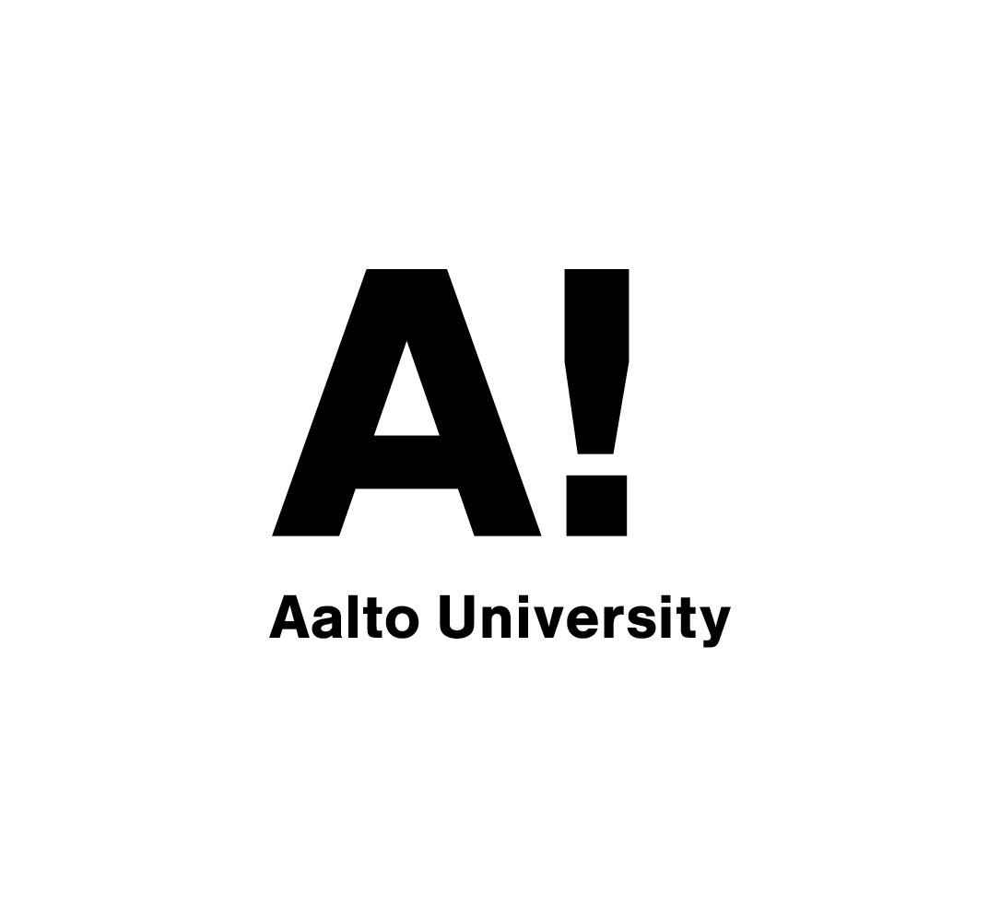
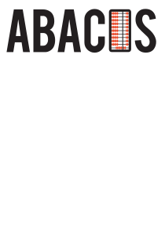

# STACK for Engineering Mathematics and the Abacus Material Bank

Antti Rasila, Guangdong Technion – Israel Institute of Technology

### Abstract

Since 2006, Aalto University has been using STACK to run online assessments within their Engineering Mathematics courses. Initially, the University was running a STACK version developed in-house specifically for the University, but this was later merged back into the main STACK branch in version 3.0. After receiving funding, the material bank Abacus was created, with the purpose of helping institutions collaborate and share STACK questions. The project's agreement was written in a way that ensured question authors kept their copyright, while still encouraging collaboration. Abacus has 30 members and its courses cover most of undergraduate mathematics and many parts of physics.

### Motivation

The MatTa group ("Matematiikkaa tietokoneavusteisesti"; "mathematics by using computers") was founded in 1990s by lecturer Emeritus Simo K. Kivelä at the Department of Mathematics and Systems Analysis at Aalto University, formerly known as Helsinki University of Technology. The purpose of the group was to investigate the use of computers and information technology to teach engineering mathematics. Initially, the projects involved, for example, using visualisations, multimedia and symbolic computation to make mathematical content more interesting and accessible for students. The group also produced a number of free Finnish language electronic lecture notes with interactive content and a substantial database of traditional pen and paper exercise assignments called Euler. In 2006, the group started to take interest in automatic assessment, as they believed computer-aided methodologies could achieve a practical impact in teaching activities there. There was also hope at the University that Computer Aided Assessment could reduce the number of students assistants required to grade homework, both to save cost and because a sufficient number of qualified graders was not always available. Initially, the group focused on the Maple T.A. system, however it was found lacking in several aspects. The most important of these were performance issues and an incompatibility with various browsers, in particular ones available for the Linux operating system. The high licensing fees were also a problem, as they could undo all the savings that the University hoped to achieve by using the system.

In spring of 2006, the group started gaining interest in STACK, which has an open source license. This license would allow the University to use its in-house software development skills to improve the platform where needed, and it would also guarantee that licence fees would not be imposed in the future. After deciding to use STACK, which was running its standalone version 1.x at the time, the group spent the summer of 2006 modifying the software to better suit the University's needs. This included replacing the rendering code of mathematical formulas to support browsers other than Microsoft Internet Explorer, translating the software to Finnish and a Shibboleth[^shibboleth] based integration with the Finnish national Haka single-sign-in system.

### Implementing STACK

After modifying the system, the University started testing STACK. The initial test was with the university's Basic Course in Engineering Mathematics KP3. A. Rasila wrote four STACK assignments for each week of the course, all of which were relatively simple questions involving numerical or algebraic input. The system had numerous small technical issues, but the students were generally happy with the system as evidenced both by student feedback and general usage statistics [1].

Encouraged by the positive results, it was decided to test the system more comprehensively to convince the teaching community that automatic assessment was worth of the effort in teaching engineering mathematics. It was important to show that the online assessment could be used by teachers with little programming skill, and that it would not cause a large increase in their workload. This was crucial for the long-term success of the project, as MatTa's previously developed materials were often only used by a handful of teachers, most of whom where developers themselves. Furthermore, the group needed to demonstrate that the system had real cost savings, as well as good learning outcomes compared to traditional types of assignments. The University set up an experimental course "Discrete Mathematics", where STACK would form a significant portion of the final grade [2]. Following the positive results of this course, the use of STACK began to spread at the University, and within three years, most basic courses in Engineering Mathematics at Aalto University were using STACK.

> An interactive STACK question from Aalto University's "Multivariable Calculus" course, where students drag points along a contour line.

### STACK Developments

A key ingredient in the success of STACK at Aalto University were the in-house developments by programmer Matti Harjula, also wrote his Master’s Thesis on this work [3]. His initial work included analysing the data of the first 2006 experiment and further developing the system to address any shortcomings. His project was successful, as it led to a system that many lecturers at the department were willing to use, and no major issues were identified in the subsequent use of the system. 

However, it also led to a new problem. Independently from Aalto University, the British STACK developers had been developing STACK 2.0, which was very different from the 1.x series Aalto University had been using for their work. The in-house developments by Aalto University were not easily implemented into STACK 2.0, but merging the Aalto University code back into the trunk of STACK was still necessary for a number of reasons. Firstly, a unified code base would speed up the overall development of STACK, and the Department at Aalto University did not intend to permanently commit many resources to maintaining the system. Secondly, there was interest from other Finnish universities to try the system, however they preferred to use the “official” British version of STACK, which would prevent them from using the materials developed at Aalto University. Because of this, the Finnish and British developers agreed to join forces in combining their work into STACK 3.0. During the STACK 3.0 merge, experimental features of STACK were also being added to the Aalto University version, as documented in section 7.8 of [4]. These features were related to several pedagogical ideas, detailed in [5,6,7].

### Creating Abacus

There were two key advancements in 2015. Firstly, STACK 3.0 was completed and Aalto University had finalised their plans to the deploy the system as a replacement to their old in-house version. Since the University was now using the official STACK version, it was easier to collaborate with other Universities on STACK material. Secondly, the consortium of the seven Finnish technology universities called for proposals in developing collaborative practices in education. A draft proposal for joint development of electronic materials for mathematics education was proposed and selected as a pilot project with over half a million euros of funding. A. Rasila was chosen as the national coordinator of this project, which become known as the Abacus[^abacus_cons] consortium [8].

> The Abacus logo.

Abacus is a database of teaching materials, mainly STACK questions, covering most basic topics in undergraduate mathematics. Its mission statement is to help lecturers find high quality and free learning materials, achieved through facilitating the sharing of online teaching resources between institutions. National and international collaboration is at the heart of the project, as it helps standardise the platform, minimise the necessary contribution of each institution and contribute to the overall market share of the platform. Language differences between courses is not a concern, since adding translations to individual questions are almost trivial compared to the expense of actually programming the mathematics e-content.

In drafting the initial consortium agreement, Abacus drew from two other related projects, namely a 2009 e-learning collaboration project with the Bavarian Virtual University VHB, which was funded by the later discontinued Finnish Virtual University, and the MatTa material bank Euler. 

### Fair Use

In projects largely developed through public and institutional funding, fair use is a common problem. Some partners may feel they are contributing more than the rest, and hence will not be interested in collaboration and instead push for in-house development. Furthermore, collaborators who develop materials without being paid are often unhappy when someone else makes even minor monetary gains from their work, which has led to a widespread use of non-commercial licenses for academic work. While understandable, these restrictions hinder the acceptance of platforms like Abacus, and lead to divisions in the community. Furthermore, non-commercial licenses can be confusing, as the exact nature of commercial activity is not clearly defined in academia. For example, is "free" work done by a salaried lecturer commercial use? Finally, it can be necessary for institutions to share the sources of assignments due to international differences in notation, course content and language. On the other hand, a pure open source model is not particularly attractive for e-assessment materials, since students should not be able to search online for the teachers' answers.

To solve these problems, the Abacus consortium agreement was written such that there are no strict legal restrictions on what kind of institutions can join the consortium or what kinds of materials can be included. The materials are shared in a way such that each partner gets substantial rights to develop them based on a license similar to open source, but is not allowed to share the source code with third parties. The original developers retain their copyright of the materials and are allowed to give them other licenses besides the one required by Abacus. Since new members are reviewed by the consortium's steering group and are required to make a one-time contribution to the consortium, the agreement encourages collaboration and guarantees that existing partners benefit from the growth of the consortium.

### Outlook

As of July 2019, the Abacus consortium consists of 30 members, 17 of which are from Finland, as well as three from Estonia and two from both Germany and Norway. Other countries present in the consortium are China, France, Ireland, Portugal, Ukraine, and the United Kingdom. There are ongoing discussions with several other potential partners, mainly from Europe. The database currently contains problem assignments for most bachelor level courses in mathematics, as well as a substantial number of physics assignments. Although Abacus accepts contributions in any language, most materials are available in English. Translations of the remaining Finnish-only materials are ongoing, and are expected to be completed in 2020.

### References

[1] A. Rasila, M. Harjula, and K. Zenger. Automatic assessment of mathematics exercises: Experiences and future prospects. In ReekTori 2007: Symposium of Engineering Education, 70-80. Helsinki University of Technology, Finland, Teaching and Learning Development Unit, http://www.dipoli.tkk.fi/ok, 2007.
[2] A. Rasila, L. Havola, H. Majander, and J. Malinen. Automatic assessment in engineering mathematics: evaluation of the impact. In ReekTori 2010: Symposium of Engineering Education. Aalto University, Finland, Teaching and Learning Development Unit, http://www.dipoli.tkk.fi/ok, 2010.
[3] M. Harjula. Mathematics exercise system with automatic assessment. Master's thesis, Helsinki University of Technology, 2008.
[4] C. J. Sangwin. Computer Aided Assessment of Mathematics. Oxford University Press, Oxford,
UK, 2013.
[5] H. Majander and A. Rasila. Tutkimus suuntaamassa 2010-luvun matemaattisten aineiden opetusta, Experiences of continuous formative assessment in engineering mathematics, 197-214. Tampereen yliopistopaino Oy - Juvenes Print, 2011.
[6] A. Rasila, J. Malinen, and H. Tiitu. Automatic assement and conceptual understanding. Teaching Mathematics and its Applications, 34(3):149-159, 2015.
[7] T. Pelkola, A. Rasila, and C. J. Sangwin. Investigating Bloom's learning for mastery in mathematics with online assessment. Informatics in Education, 17(2), 363-380, 2018.
[8] A. Rasila. E-assessment material bank abacus. In Proceedings of EDILEARN16, 8th Annual
International Conference on Education and New Learning Technologies, July 2016.

[^abacus_cons]: ABACUS is available at https://abacus.aalto.fi/
[^shibboleth]: See https://www.shibboleth.net/
