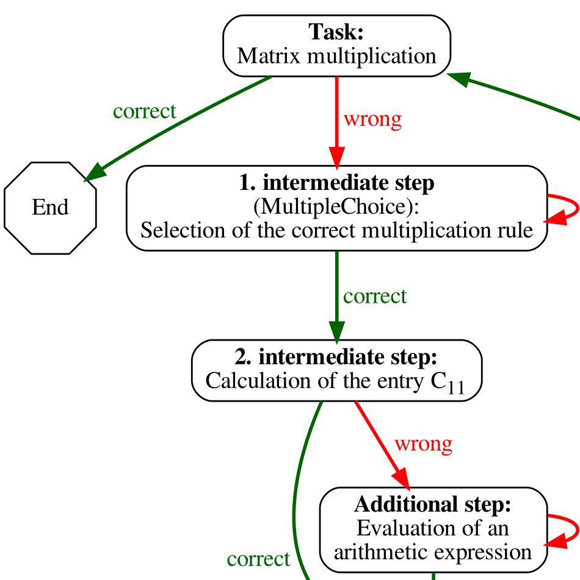
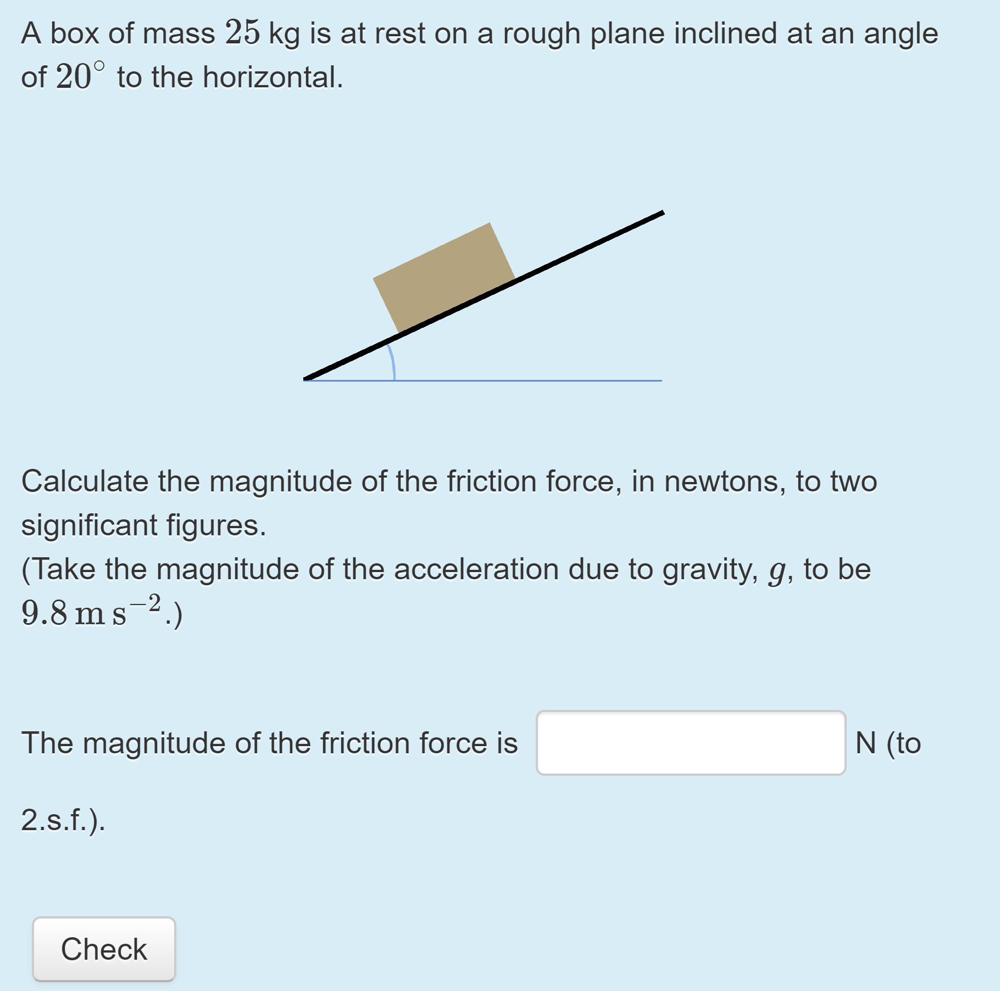

# Who uses STACK?

STACK has users all over the world. To highlight some of the ways STACK is used and developed around the world, we have written a number of case studies. Explore the map, or see the full list of case studies below.

<i class="material-icons" style="color:#a52714">stars</i> &nbsp;<b>Case studies</b>

<i class="material-icons" style="color:#0288d1">place</i>&nbsp;<b>Other key users</b>

<iframe src="https://www.google.com/maps/d/u/5/embed?mid=1auYEFzIF752n121gCZKTRW54mSSo6AZ6" width="100%" height="500px"></iframe>

#2019

In 2019, a project was carried out to write an initial collection of STACK case studies. The case studies were edited by Malthe Sporring and Chris Sangwin, and funded by CATE.

<!--

  <h5 class="card-header">Case Studies Booklet</h5>
  

    
A booklet containing every case study from 2019 is available as a PDF.

    <a href="%CONTENT/2019-cate-case-studies.pdf" class="btn btn-primary">Case Studies Booklet</a>
  

-->

<a class="btn btn-danger btn-lg" href="../MISSING" role="button">Case Studies Booklet</a>

 

    

      
      

        <a href="2019/FAC"><h5 class="card-title">Developing a Fully Online Course</h5></a>
        
"Fundamentals of Algebra and Calculus" is a fully online course that uses STACK.

      

  

    

      
      

        <a href="2019/PhysicsCurriculum"><h5 class="card-title">STACK for a Physics Textbook</h5></a>
        
Physics Curriculum & Instruction have developed STACK questions to accompany a Physics textbook.

      

    

    

      
      

        <a href="2019/Adaptive"><h5 class="card-title">Adaptive Self-learning Exercises</h5></a>
        
The Ruhr-Universität Bochum uses STACK in online courses designed for self-study. Some questions are adaptive, and guide students through complex tasks.

      

    

 

    

      
      

        <a href="2019/FlickInterface"><h5 class="card-title">A Flick Interface for Maths Input</h5></a>
        
Developers at Nagoya University are building a "flick interface" for STACK, similar to the popular Japanese keyboard mode.

      

  

    

      
      

        <a href="2019/Maseno"><h5 class="card-title">Innovating Education in Maseno, Kenya</h5></a>
        
IDEMS international is working with Maseno University to implement online assessment for their mathematics courses.

      

    

    

      
      

        <a href="2019/optes"><h5 class="card-title">optes: Optimising Self-study With STACK</h5></a>
        
The optes project uses STACK in their pre-course, designed to help students improve their self-studying skills.

      

    

 

    

      
      

        <a href="2019/ILIAS"><h5 class="card-title">Technical Integration of STACK Into ILIAS</h5></a>
        
STACK was integrated into the ILIAS learning management system to support projects for learning content.

      

  

    

      
      

        <a href="2019/StackAtScale"><h5 class="card-title">STACK at Scale: The Open University</h5></a>
        
The Open University uses STACK for large-scale online courses.

      

    

    

      
      

        <a href="2019/Abacus"><h5 class="card-title">STACK for Engineering Mathematics and the Abacus Material Bank</h5></a>
        
Aalto University uses STACK for their Engineering Mathematics courses, and they have also developed the material bank Abacus.

      

    

 

    

      
      

        <a href="2019/Loughborough"><h5 class="card-title">Promoting STACK Across Disciplines at Loughborough University</h5></a>
        
At Loughborough University, STACK has been implemented across many disciplines.

      

    

    

      
      

        <a href="2019/Edinburgh"><h5 class="card-title">Institutional Support for STACK in Edinburgh</h5></a>
        
The University of Edinburgh has in-house support for online assessment, mostly with STACK, for most year one and two mathematics modules, and many more.

      

    

    

     

