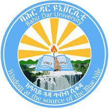

# Maths in Ethiopian higher education: A moment in time

## Responding to national educational upheaval with student-centred support for Ethiopia

David Stern, Santiago Borio, Georg Osang, David Whittaker, Getachew Mehabie Mulualem, Abdu Mohammed Seid, Mebratu Fenta Wakeni, Michael Obiero

    <figure class="figure">
        
        <figcaption class="figure-caption">Figure 1: Worshop group photo</figcaption>
    </figure>

### Challenges and priority actions from the Bahir Dar STACK Workshop 19-23 March 2023

Higher education in Ethiopia is currently responding to multiple challenges stemming from national reforms. Bahir Dar University (BDU) is rising to these challenges by seizing the opportunity for change to improve the provision of student centred learning and support for maths and related courses.

The BDU Mathematics Department recognises the leadership role it has, specifically as a role model for other Ethiopian Universities. In March 2023 the BDU Mathematics Department brought together 49 people from 12 Ethiopian universities to identify priority challenges and actions as foundations for an ambitious, yet achievable, approach to improved quality, consistency and results in mathematics education at this crucial moment in time. This event was co-facilitated  by 3 IDEMS International Staff and a Kenyan Educational Innovator who brought in STACK expertise at BDU’s request as this was an open source tool they had identified which could add value to their teaching and learning.

This case-study outlines 3 of 15 reported outcomes of the event, described in detail in a <a href="https://docs.google.com/document/d/19eZA1ndHAUGAdWQCtb5DfmKohOy3pATabZlovOeJQAU/edit?usp=sharing" target="_blank">draft report</a>. These three highlighted opportunities stand out because of their urgency with all three needing immediate action. Two of the three correspond to supporting students in preparation for unprecedented exams that will take place within the next 4 months. After August, this moment in time will have passed. Supporting student success at this crucial time has institutional and national ramifications.

    <figure class="figure row">
        
        
        <figcaption class="figure-caption col-12 text-center">Figure 2: Discussion and practical workshop sessions</figcaption>
    </figure>

### 1. Remedial learning support by July 2023

#### Challenge

In 2023 only <a href="https://www.thereporterethiopia.com/30474/" target="_blank">3% of school leavers achieved passing grades</a>, leaving <a  href="https://borkena.com/2023/01/29/ethiopias-education-disaster-revealed-in-university-entrance-exam/" target="_blank">thousands without the university place they applied for</a>. All Ethiopian universities have been mandated by the Ministry of Education to provide remedial courses for prospective students to enable them to start their degrees.

Delivery for these courses started in early April and is expected to run for 16 weeks, followed by an exam. There is a huge need and potential to significantly alleviate the expanded staff workload imposed by remedial courses and support student learning through STACK.

IDEMS and staff at BDU are co-designing a STACK remedial course in maths, in which any university can enrol their students. The course will cover all topics in the remedial course, and provide formative assessment to allow students to gain from personalised feedback and consolidate mastery through repeated attempts of randomly generated versions of each question.

#### Action: Rapid response teaching and learning support for maths

The STACK course is in development and each new topic will be released on a weekly basis. If the full course is implemented, students nationally will gain targeted learning and support for remedial maths, increasing the chance of students securing their place at university as planned.

#### Intended outputs and impacts:

1. A single online course with mastery questions for each topic in the curriculum (13 areas of maths in total).
2. Topics available from April 2023 to BDU (and up to 100,000 students at other universities nationally adopting the system).
3. Remove mathematics as a barrier for remedial student success. The shortfall in new students in 2023 could be minimised, reducing the consequent lack of new future graduates as this year’s crisis works through progression rates.

### 2. National Exit Exam support by June 2023

#### Challenge

<a  href="https://ethiopianmonitor.com/2022/12/09/university-exit-exam-set-for-june/" target="_blank">The Ethiopian school exit exam</a> is at the forefront of Ethiopian Universities minds at the moment. An institution's future desirability is will be strongly linked to their current students' performance. In Mathematics such an assessment is almost unprecedented and universities are looking to each other for support to ensure their students are prepared.

#### Action: online preparation for the first exit exams in 2023

A majority of the mathematics curricula to be tested in exit exams is already available as digital questions from institutions using STACK in Kenya and Tanzania. Importing these existing questions would populate 50-75% of the exit exam blueprints for maths in Ethiopia, reducing development time and costs, and increasing the readiness of universities for exit exams in June 2023. This would serve all BSc/BEd maths students nationally, plus a <a href="https://ethiopianstoday.com/2022/12/02/ministry-of-education-to-roll-out-college-exit-exam/" target="_blank">greater number of others with a maths component to their degree</a>, e.g. accounting, engineering, statistics, data science.

The same system would also enable new material for preparation and revision for the exit exams to be re-used among Ethiopian universities, sharing the development resources required and increasing the speed at which outstanding curriculum gaps could be collectively filled. By continuing to develop exit exam revision content, 100% of the blueprint would be available for online preparation in time for the 2024 round of exams.

#### Intended outputs and impacts:

1. Most of the current exit exam blueprints for maths would be available to support students via STACK in May-June 2023.
2. A set of probable exam style questions for practice tests covering the whole blueprint in May-June 2023.
3. All of the current exit exam blueprints for maths would be available to support students via STACK by June 2024.

### 3. Maths for Natural & Social Sciences by September 2023

#### Challenge

Maths for Natural/Social Sciences is a core course for all university degree programmes in Ethiopia.  Nationally, a significant challenge is for Maths departments to coordinate the teaching and learning of thousands of students, with varying levels of interest and enthusiasm, taking this foundational maths course.

#### Action: Make Maths for Natural/Social Sciences into critical building blocks for engagement and achievement for all first year students across disciplines

STACK supports both lecturers and learners simultaneously:

1. By automating regular assessment with automated grading, personalised student feedback and support, lecturers’ role can focus on motivating students and building the relevance of the material to students' respective interests. </li>
2. By giving immediate tailored learning feedback on demand, students gain control over how, when and where they engage in learning. This formative assessment approach has been successful at engaging students in other contexts and could reposition first year courses as an engaging foundation for higher education rather than an unwelcome barrier to it.

#### Intended outputs and impacts:

1. STACK pilot at BDU starting in April 2023 with up to 1500 students.
2. STACK system available to all undergraduate students nationwide from September 2023.

### An additional opportunity: Ethiopian textbooks for Secondary School Mathematics

During the workshop IDEMS staff had the opportunity to interact with a number of members of the BDU Mathematics department who were commissioned by the Ethiopian Ministry of Education to write textbooks for secondary school mathematics. For various circumstances, the decision was made to share these textbooks in electronic format. As such, the textbook authors who attended the workshop were interested in the idea of making the textbooks interactive by integrating STACK questions. An agreement was reached to build a prototype of an interactive textbook for two topics which would demonstrate how students can practice and get relevant feedback on their attempts at questions. IDEMS are working with one of the textbook authors on creating a prototype for the topics of Equations and Vectors which they intend to present within BDU and potentially to the Ministry as an alternative delivery mechanism.

### Partners

The workshop was organised and hosteds by Bahir Dar University, Ethiopia, led by IDEMS International, UK, and supported by INNODEMS, Kenya, and Maseno University, Kenya. Financial support for the participation of key stakeholders was provided by the University of Geneva and the Swiss National Science Foundation.

   

      

         
 
         <h4>Bahir Dar University</h4>

      

      

         
 
         <h4>IDEMS International</h4>

      

      

         
 
         <h4>INNODEMS</h4>

      

   

    
   

      

         
 
         <h4>Maseno University</h4>

      

      

         
 
         <h4>Swiss National Science Foundation</h4>

      

      

         
 
         <h4>Université de Genève</h4>

      

   

<nav aria-label="...">
  <ul class="pagination pagination-lg justify-content-center" style="margin-top:2em">
	<li class="page-item"><a href="../../2023/Partial_frac_int" class="page-link"><i class="fa fa-arrow-left"></i>&nbsp;Integration using partial fractions and STACK&nbsp;</a></li>
    <li class="page-item"><a href="../../2019/FAC" class="page-link" >&nbsp;Developing a Fully Online Course&nbsp;<i class="fa fa-arrow-right"></i></a></li>
  </ul>
</nav>

