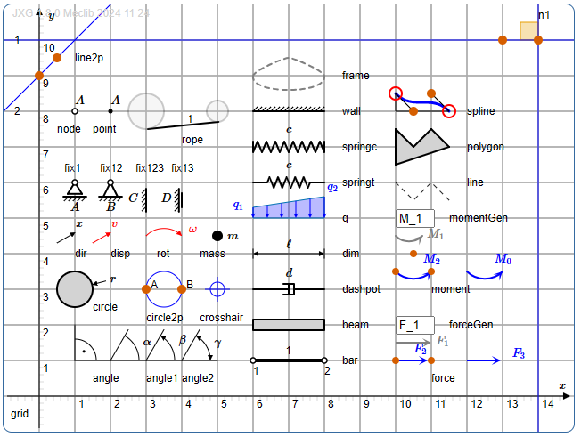
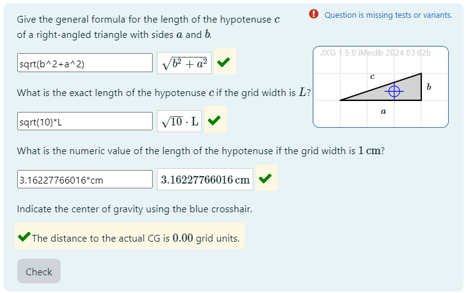
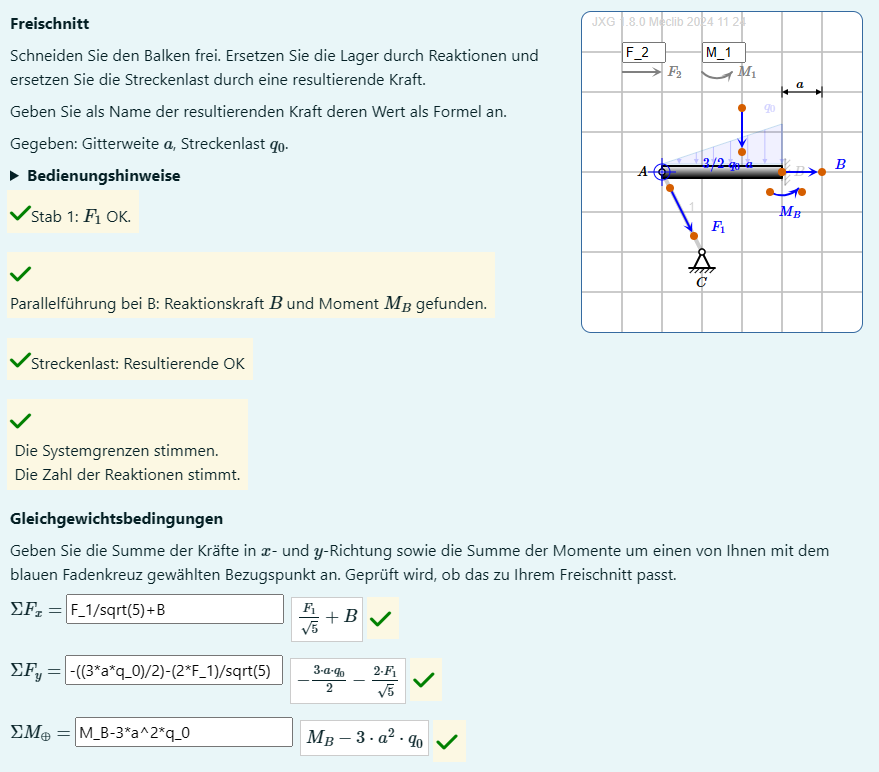
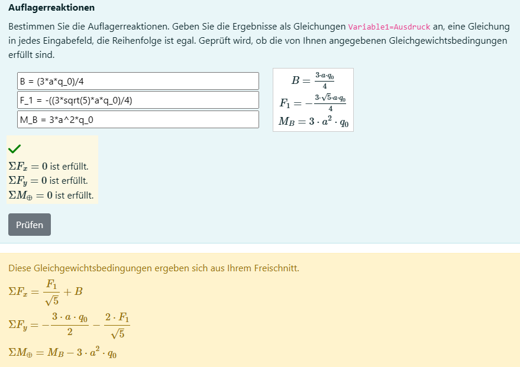
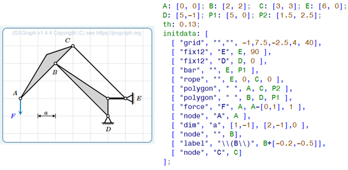
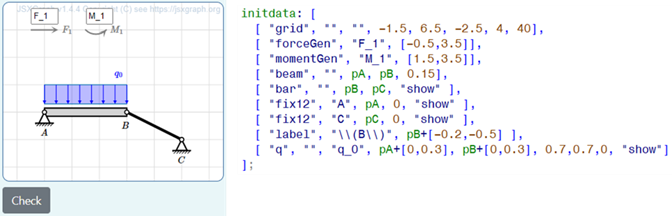
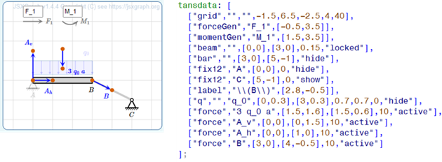
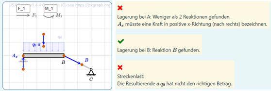
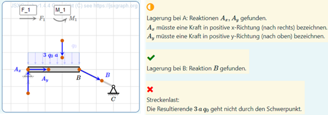

# Meclib: supporting mechanical systems

Martin Kraska

### Introduction

Meclib is a set of tools to simplify authoring of STACK questions with a focus on 

- JSXGraph based static and interactive illustrations controlled by Maxima lists (defined in the question variables).
- Maxima functions for rich formative feedback on interactive graphic input and on numeric or symbolic expressions.

The set of objects is created with sketches of mechanical systems in mind.  This includes support for load symbols, bars, ropes, disks and annotations. The most advanced application is the interactive creation of free body diagrams with rich formative feedback.



Mechlib is a set of optional libraries, and the primary website of the project is on Github [https://github.com/mkraska/meclib/](https://github.com/mkraska/meclib/), where a good entry point is the [Wiki](https://github.com/mkraska/meclib/wiki).

There is a demo Moodle site, where Meclib examples can be tested. It is hosted at Brandenburg University of Applied Sciences (Technische Hochschule Brandenburg, THB).

[External Moodle Course](https://extmoodle.th-brandenburg.de/course/view.php?id=138) (May 2025)

- You can create an account on the server or use the guest login.
- You need an account to actually access the demo questions, the other contents (slides, papers) can be accessed with guest login.
- No course password required.

### Getting started with Mechlib

Martin Kraska, the author, of Meclib has developed two introductory workshop formats. They are documented in the Meclib [wiki](https://github.com/mkraska/meclib/wiki). With basic experience in authoring STACK questions, these workshops can be worked through without assistance. Guided workshops can be booked (kraska@th-brandenburg.de). 

- [My first Meclib question](https://github.com/mkraska/meclib/wiki/My-first-Meclib-question) is a tutorial for a simple question with interactive input (locate the center of gravity of a triangle). This workshop takes approximately 1.5 hrs if the basics of STACK questions are known.
  


- [FBD Example Question](https://github.com/mkraska/meclib/wiki/FBD-Example-Question) is a tutorial for a STACK question with the interactive free body diagram editor, input of equilibrium conditions and support reactions. This workshop takes 6 hrs in total. For guided workshops, a distribution over two days is recommended in order to provide intermediate space for individual tryout by the participants.
  
  

### Maxima driven JSXGraph graphics

The basic idea behind Meclib is that question authors can embed high quality, visually consistent sketches with or without interactive elements into their STACK questions without writing a single line of Javascript. All contents of the graphics is driven by a Maxima list of object description lists inside the question variables. 



This list is injected into a generic part of the question text, which contains a `[[JSXGraph ]]` block. In the early stages of Meclib development, this generic block contained the full JavaScript code (more than 2000 lines). Currently, the embedding using `[[include ]]` is recommended.

This is how the generic Meclib block for a static (non-interactive) image in the question text looks like (usually it is copy-pasted from the Meclib wiki)

```
[[lang code="de"]] [[/lang]][[lang code="other"]] [[/lang]]
<div style="float:right">
[[jsxgraph width='250px' height='250px' ]] 
var mode  = "STACK";           // As opposed to "jsfiddle" which is used with the test environment.
var stateRef;                  // Is empty with the non-interactive case.
const initstring = {#init#};   // Injection of the list of objects, defined as a Maxima list.
var decsep = {#stackfltsep#};  // Injection of the decimal separator setting.
const centeredLabelStyle = {
  size:0, 
  showInfobox:false, 
  label:{offset:[-6,0], anchorX:'left', anchorY:'middle'}
  };
// End of STACK header.
[[include src="https://raw.githubusercontent.com/mkraska/meclib/main/meclib.js" /]]
[[/jsxgraph]]
</div>
```

Setting up such graphics is quite easy, getting started takes just a couple of hours and can be mastered by student assistants, including randomization.

For interactive graphical input, the `[[jsxgraph ]]` block is bound to two hidden input fields. `objects` is a string input filed, which stores a JSON version of the graphics specification. If the user modifies a graphic, these changes are reflected in this input field. Beyond the modification of existing objects, this includes dynamically generated or deleted objects, as required for interactive edit of free body diagrams.

`names` is an algebraic input field, where e.g. the names of interactively created forces and moments are stored as maxima expressions for further processing in the feedback trees (PRT).

For such questions, the basic effort is not in setting up the graphics side but in consistent and comprehensive feedback. 

### Editor for free body diagrams

Right from the start, Meclib was developed with the automatic assessment of free body diagrams (FBD) in mind. These are idealized drawings of mechanical systems, where the system is isolated by removing the environmental components and replacing their action by forces and moments (constraint reactions). Only after this step, equilibrium conditions can be established, which then are solved for the unknown reactions. Therefore, drawing correct FBDs is an important skill in engineering mechanics.

Based on observations of typical mistakes in written exams and classroom exercises, the following requirements and design decisions for an FBD training and assessment tool have been established by the author:

-	The system schematic should preferably be built of standard elements (objects).
-	System isolation is visualized by graying out elements of the environment (connectors, supports), thus no new sketch is made but the FBD is created in place.
- The user can create, delete and label force and moment symbols.
- The attribution of user-generated objects to individual system elements is done via automatic proximity checks on JSXGraph side.
- Intelligent snap mechanisms enable precise positioning and orientation of reactions, even if that might give unwanted hints.
- There should be rich formative feedback for the individual decisions made while creating an FBD.
- Based on the force and moment symbols introduced by the user, the reference solutions for equilibrium conditions are auto-generated and used for feedback on student solution. This is why labelling and precise positioning are required.

In particular, the last requirement initially seemed non-trivial, because the standard interface between STACK and JSXGraph doesn’t allow for extraction of symbolic expressions from text input fields. Thus, an additional algebraic input field needs to be bound to the JSXGraph board.

The following images show an idealized initial system and the completed FBD along with their respective representation on Maxima side. The elements `forceGen` and `momentGen` at the top of the canvas are generators for force and moment symbols. In the text fields, the label can be entered. The object is created by dragging the gray symbols away from their position. Elements of the system can be deactivated by double-clicking. 

The next image shows the initial system schematic and Maxima list of object specifications. The task is to replace the sup-ports by appropriate reactions and the distributed load by a resultant force. Whenever the button Check is pressed, feedback is generated



The next image shows the reference solution and the corresponding Maxima list of objects. This list is specified as model solution just for display purposes (review by trainer, worked solution for the student). Note that there are many other correct solutions, such that the assessment must go far beyond a simple comparison.



Meclib has specific feedback functions for most support objects. According to the above-mentioned design decision, proximity checks between supports and reactions (or distributed load and resultant) are performed on JSXGraph side using its powerful object methods. The feedback functions for free body diagrams aren’t internationalized yet and therefore in German. 

As an example, the checks performed for a fixed support (as in point A) are:

1.	Is the object really a fixed support? This is just for question developers.
2.	Is the object deactivated?
3.	Any reactions reported from the proximity check?
4.	Are there exactly two reactions?
5.	Are both reactions of type force?
6.	Are the names of the reactions unique (not identical)?
7.	Are the directions of the two reactions different (non-parallel)?

Further checks for the names are performed in a separate function to allow for partial credit. 

9.	Is the base name a single character?
10.	Does the base name match the name of the support point?
11.	Is there a direction index?
12.	Is the index a single character?
13.	Is the index one of x, y, h(orizontal) or v(ertical)?
14.	Does the index match the actual direction of the force?

The sequence of tests is designed such that whenever a test fails, the appropriate feedback is generated and further tests are skipped, because they would not make sense.  Using complex feedback functions allows for extremely compact potential response trees in the STACK question.  This is a prime example where it is sensible to extend core functionality with a significant library, rather than write complex individual questions. The adaptive question mode in STACK allows the user to retry until all requirements are met. 

In the following image, the distributed load and the supports have been deactivated, yet the created resultant doesn’t have the correct value. Support B has been replaced by a correct reaction with an appropriate label. Support A needs more reactions and the subscript x isn’t appropriate for vertical direction.



Here, the resultant force doesn’t go through the centroid of the distributed load. Support A is now replaced by correct reactions, yet the labels are inconsistent.




### Feedback functions

Besides the specific feedback functions for free body diagrams, Meclib comes with two feedback functions for algebraic expressions and numerical values with or without units.

The function `fb_vars()` usually is placed in the feedback for FALSE in an algebraic equivalence answer test. The basic function of this test is to indicate spurious and missing variables and provide hints on how to write the missing variable. 
Using this function throughout all questions with algebraic input has eliminated nearly all issues with misspelling of variables.

The function `fb_unit()` is used in the feedback for FALSE in numeric answer tests with or without units. It complains about unexpected base units and gives hints on how far off the numeric value of the answer is. So the students get a clue whether they just didn't calculate with sufficient precision, did perhaps a wrong unit conversion or possibly have used a wrong formula.

These feedback functions can be tested on the [Meclib Moodle Course](https://extmoodle.th-brandenburg.de/course/view.php?id=138)

For each of the two functions, there is an interactive tryout test, where you can specify student's and teacher's response along with  possible options and see the feedback that would be generated for this function call.

Also there are test suits, showing the feedback generated for pre-defined test cases.

### Localization

Mechlib works with STACK's localization features:

- Meclib is fit for multilingual feedback and configurable decimal separator. 
- Multilingual feedback uses the STACK language block `[[lang ]]`. 

### Current State and future plans

Starting in 2020, the Meclib concept has been presented at JSXGraph and STACK user meetings. In 2023 and 2024 introductory workshops have been given at the user meetings. Meanwhile it is used throughout the courses of Engineering Mechanics at Brandenburg University of Applied Sciences in more than 200 STACK questions and has survived several updates of Moodle, STACK and JSXGraph. Such updates usually require some adjustments of the Meclib code. Once these are made, the questions just need to be recompiled to let them take effect. 

Question level adjustments may be required, when new features are implemented like multilingual feedback or adjustable decimal separator.

In 2024, an advanced Meclib workshop has been given at the Hochschule Ruhr West (University of Applied Sciences) in Mühlheim/Ruhr (contact: Jonas Lache).

At Hochschule Bochum (University of Applied Sciences), numerous STACK questions with static randomized Meclib images have been created for various courses  of Engineering Mechanic (contact: Mirko Siegert, Ulrich Zwiers).

The Meclib concept has been successfully ported to STACK under Onyx (Saxony's learning management system) by Marcus Seidel at Fachhochschule Zwickau (Unitversity of Applied Sciences). [Demo site](https://bildungsportal.sachsen.de/onyxeditor/published/MecLibDemo))

Meclib will be part of the efforts to extend the application of STACK to subjects beyond mathematics. An important activity is the project "Deutsches Zentrum für digitale Aufgaben" (German center for digital exercises) coordinated by the OTH Amberg-Weiden (University of Applied Sciences).

The ToDo-list of further developments mainly contains extended feedback functions for free body diagrams. This includes trussworks and multi-body systems with emphasis on "actio=reactio" as well as handling of friction and rolling contacts.

Another action item is the extension of the internationalization approach from currently just two basic feedback functions to the entire library.

Based on user requests, the object library can be extended by symbols beyond mechanics, e.g. electronic circuitry.

Whenever implementing a feature in a STACK question requires more than a couple of thoughts and is to be used in more than a single question, then it is a candidate for inclusion in Meclib. 

## Reference

Kraska, Martin, & Schulz, Dennis. (2021). Automatic assessment of free body diagrams using STACK. Presented at the International Meeting of the STACK Community 2021, Zenodo. [http://doi.org/10.5281/zenodo.4916138](http://doi.org/10.5281/zenodo.4916138)

Kraska, Martin. (2022). Meclib: Dynamic and interactive figures in STACK questions made easy. Presented at the International Meeting of the STACK Community 2022, Leoben, Austria. [https://github.com/mkraska/meclib/blob/main/References/STACK%202022%20Kraska%20V2.pdf](References/STACK%202022%20Kraska%20V2.pdf)

Kraska, Martin. (2022). Meclib: Dynamic and Interactive Figures in STACK Questions Made Easy. International Journal of Emerging Technologies in Learning (iJET). 17. 15-27. [http://doi.org/10.3991/ijet.v17i23.36501](http://doi.org/10.3991/ijet.v17i23.36501). 

