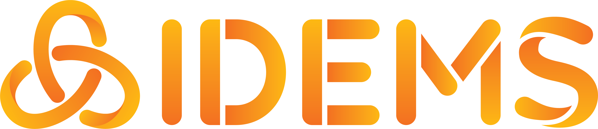
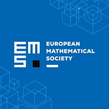

# The 2026 International Meeting of the STACK Community, Nairobi, Kenya

*Wycliffe Rao, Juma Zevick Otieno, Michael O. Oyengo, Santiago Borio*

---

## Introduction and Overview

The International Meeting of the STACK Community 2026 was held from 27–31 July 2026 at the University of Nairobi, Chiromo Campus, Kenya. The five-day meeting brought together university lecturers, mathematics and STEM education researchers, STACK developers, educational technology practitioners, students, and other members of the STACK community. The programme included presentations, parallel sessions, practical workshops and panel discussions. On the opening day alone, approximately 75 colleagues attended.

<figure class="figure">

<figcaption class="figure-caption text-center">Participants at the International Meeting of the STACK Community in Nairobi.</figcaption>
</figure>

## Conference Aims and Context

The meeting aimed to provide a forum for the STACK community to share current work, develop practical skills, discuss research and emerging developments, and strengthen connections between institutions using STACK. An important context for the Nairobi meeting was the continued growth of STACK activities in Africa and their increasing connection with the wider international community. Previous STACK meetings and workshops had already generated collaborations that developed into training activities, shared assessment materials and digital learning resources, providing a foundation for further exchange in Nairobi.

## Conference Programme

The five-day programme included presentations, practical workshops, panel discussions, and demonstrations, organised through both joint and parallel sessions. This gave participants opportunities to share their work, gain practical experience with STACK, and exchange ideas throughout the meeting.

<table class="table table-bordered">
<caption>Program Summary</caption>
<thead>
<tr><th>Day</th><th>Main activities</th></tr>
</thead>
<tbody>
<tr><td>Monday, 27 July</td><td>Opening, presentations and practical workshops</td></tr>
<tr><td>Tuesday, 28 July</td><td>Presentations, parallel sessions and workshops</td></tr>
<tr><td>Wednesday, 29 July</td><td>Parallel presentations, excursion and conference dinner</td></tr>
<tr><td>Thursday, 30 July</td><td>Presentations, parallel sessions and discussions</td></tr>
<tr><td>Friday, 31 July</td><td>Joint sessions, discussions and conference closing</td></tr>
</tbody>
</table>

The [full conference programme](../../Events/2026-07-27-Conf-2026/programme.md) is available on the STACK website.

## Major Themes Emerging from the Meeting

The presentations and discussions highlighted several recurring themes across the meeting. These reflected both ongoing developments in STACK and broader questions about its use in mathematics and STEM education. The main themes included:

### Generative AI and the Future of STACK

Several sessions explored the growing role of artificial intelligence in STACK, including AI-assisted question authoring, STACK-specific assistants, multi-agent approaches, feedback and analysis of student responses. Discussions also highlighted the importance of maintaining human oversight as these tools develop.

### Free-text Input, Feedback and Learning Analytics

Presentations considered how students enter mathematical expressions and how their responses can provide information beyond whether an answer is correct or incorrect. This included work on mathematical input, analysis of student errors and solution processes, and new approaches to interpreting student reasoning.

### STACK Adoption and Institutionalisation

Experiences from different institutions showed how STACK adoption develops from initial pilots and staff training towards broader implementation. Discussions highlighted institutional support, infrastructure, staff capacity, quality assurance and sustainability as important factors in successful adoption.

### Open Educational Resources and Shared Materials

Another theme was the development and sharing of reusable educational resources. Presentations covered the STACK Library and other open question banks, interactive digital textbooks, PreTeXt integration, question sharing and peer review of assessment materials.

### Competency-Based Education and Curriculum Reform

The meeting also considered STACK within wider changes in education, particularly Kenya's competency-based education reforms. The discussions focused on assessment practices, teacher preparation, university readiness and the potential role of digital tools in supporting these changes.

### Collaboration and Community Building

Collaboration was a recurring theme throughout the meeting. Participants shared examples of partnerships developed through previous STACK conferences and workshops, including joint training, resource development, research and implementation across institutions and countries.

## Workshops and Hands-on Activities

Alongside the presentations and discussions, the conference included practical sessions designed to give participants direct experience with STACK and related technologies.

<table class="table table-bordered">
<caption>Practical Sessions Summary</caption>
<thead>
<tr><th>Practical session</th><th>What it entailed</th></tr>
</thead>
<tbody>
<tr><td><strong>Introduction to STACK Authoring - Juma Zevick Otieno</strong></td><td>Introduced beginners to the basic STACK question-authoring workflow through a live demonstration and guided creation of their own questions.</td></tr>
<tr><td><strong>Building Interactive Books with PreTeXt</strong></td><td>Introduced participants to creating and previewing interactive materials with PreTeXt, including the integration of STACK questions and JSXGraph.</td></tr>
<tr><td><strong>STACK/JSXGraph Interactive Question Development</strong></td><td>Demonstrated how STACK, Maxima, JavaScript, JSXGraph and JSON can be combined to develop interactive assessment questions.</td></tr>
<tr><td><strong>Calculus with JSXGraph and STACK - Alfred Wassermann</strong></td><td>Demonstrated interactive mathematical visualisations using JSXGraph with STACK and PreTeXt, including applications in calculus, statistics and 3D graphics.</td></tr>
</tbody>
</table>

## Panel Discussions and Wider Questions

Panel discussions provided an opportunity to move beyond the technical aspects of STACK and consider wider educational, institutional and community questions. One panel brought together key members of the African STACK community to discuss their ongoing projects, the challenges they face in implementing and scaling STACK, and opportunities for future development and collaboration across the continent. Other discussions addressed competency-based education, teacher preparation, university readiness, infrastructure, institutional adoption, access and sustainability. In particular, participants considered how universities should prepare for students progressing through competency-based curricula, and whether existing approaches to teaching, assessment and lecturer preparation are sufficiently aligned with these changes.

Another recurring concern was how successful small-scale initiatives can develop into sustainable institutional practice. Experiences shared across institutions highlighted challenges such as securing staff and management buy-in, providing adequate infrastructure and training, supporting large student cohorts, and ensuring equitable access to devices and connectivity. The discussions therefore placed STACK within a broader question for the community: how can digital assessment move from successful individual initiatives to sustainable and institutionally supported educational practice?

## The African STACK Community

This meeting highlighted the continued growth of the [African STACK Community](../../Communities/African_leadership.md), building on earlier workshops, conferences and institutional initiatives across the continent. Experiences from Kenya, Ethiopia, Tanzania, Ghana, Somalia and other countries showed different stages of STACK adoption, ranging from individual lecturers introducing STACK in their courses to institutions expanding its use across multiple programmes. In Kenya, for example, Masinde Muliro University of Science and Technology (MMUST) reported growth from an early pilot to the use of STACK in up to 20 undergraduate courses.
Despite this progress, common challenges remain, including institutional buy-in, infrastructure, funding and the capacity to train and support new users. Ethiopia has responded by providing introductory STACK training to representatives from different universities within Ethiopia, while experiences from Tanzania showed how adoption can grow through small teams even where institutional support is initially limited. These experiences reinforced the importance of continued collaboration, shared resources and capacity building, while strengthening connections between African institutions and the wider international STACK community.

## Emerging Directions for STACK

The meeting highlighted several directions for the future development and use of STACK. Generative and agentic AI featured prominently, with discussions exploring their potential to support question authoring, feedback, analysis of student responses and more open forms of assessment. Other developments included open-text and handwritten mathematical input , learning analytics, shared question libraries, interactive digital textbooks, and closer integration with tools such as PreTeXt and JSXGraph.

The discussions also showed STACK expanding beyond its traditional applications in mathematics. Examples include its use in statistics and data science, where interactive visualisations and tools-based assessment can allow students to work with statistical software or AI tools while receiving assessment and feedback through STACK. There is also a considerable expansion into school work, moving STACK beyond the original use in universities.  Collectively, these developments point towards a broader role for STACK as a platform supporting increasingly interactive, flexible and technology-rich forms of STEM assessment.

## Challenges and Emerging Solutions

The meeting highlighted several challenges associated with the continued development and wider adoption of STACK, while also presenting possible solutions. One recurring issue was mathematical answer input, particularly the difficulty students can experience when translating conventional mathematical notation into syntax that a computer can interpret. This can be particularly challenging on mobile devices; the Somali National University experience, for example, reported difficulties entering mathematical expressions because many students accessed STACK through smartphones. Nakamura presented developments from the Japanese STACK community aimed at making input more intuitive, with tools such as Flick Math, iFlickMath, MathTOUCH and support for handwritten input. 

Another challenge was the time and expertise required to develop large collections of high-quality STACK questions. The STACK Library was presented as one response: a shared repository where educators can reuse, adapt and contribute assessment resources rather than developing every question from scratch. This approach would reduce authoring workload while encouraging collaboration and wider access to quality-assured materials. Meike Akveld also presented the ATLAS project as another initiative relevant to the development and sharing of digital mathematics resources. AI-assisted authoring was also discussed as a potential solution. David Stern highlighted open question banks and authoring assistants, while Santiago Borio demonstrated a STACK-specific AI assistant capable of creating, reviewing and improving questions. However, limitations such as hallucinations and the continuing need for expert validation were also emphasised. 

STACK can be available institutionally but still produce uneven outcomes when adoption differs between lecturers or parallel class groups.  At the institutional level, access, infrastructure and consistent staff adoption remained important challenges. At MMUST, limited access to suitable devices and reliable internet connectivity continued to affect some students. Another concern was ensuring that STACK adoption extended beyond a small group of lecturers to the wider department, particularly in courses taught by several instructors across parallel groups. The conference discussions showed that differences in how lecturers integrate STACK can lead to uneven student experiences and outcomes, with some groups benefiting more strongly from STACK-supported assignments than others. Similar differences across parallel teaching groups were also observed in data presented from the University of Trieste, reinforcing the importance of coordinated implementation, staff training and shared assessment practices. Academic integrity was a further concern at MMUST, where discrepancies between continuous-assessment and examination performance raised questions about possible impersonation or cheating. These experiences suggest that successful scaling of STACK depends not only on providing the technology, but also on building a broad staff participation, consistent implementation practices and sustained institutional support.

## Next Steps

The Nairobi meeting strengthened ongoing collaboration within the STACK community and identified several practical next steps. These included further institutional adoption and training, continued development and sharing of open educational resources, and wider implementation of materials developed through previous collaborations. At MMUST, the Physics Department was identified as the next department expected to adopt STACK, while representatives of Somalia, South Sudan, Cameroon and Ghana were keen to adopt STACK and spearhead integration within their countries. As for the African STACK meetings, Ghana, through GHAIDEMS, expressed interest in organizing the next meeting for the Summer of 2027.

## Community and Social Activities

The conference programme also included social activities that provided opportunities for informal interaction and networking. Participants visited the [Nairobi National Museum](https://nmk.go.ke/nairobi-national-museum/) and [Snake Park](https://museums.or.ke/nairobi-snake-park-and-aquarium/), followed by the conference dinner at [Amaica Restaurant](https://www.amaica.co.ke/), where they enjoyed a seven-course meal featuring Kenyan cuisine.
Following the conference, participants could also join optional post-conference safaris from 1-3 August 2026, with trips to either the [Maasai Mara National Reserve](https://www.masaimara.travel/) or [Lake Nakuru](https://kws.go.ke/park/lake-nakuru-national-park/) and [Naivasha](https://africanoverlandtours.com/blog/lake-naivasha-kenya/) / [Hell's Gate](https://kws.go.ke/park/hells-gate-national-park/). These activities provided additional opportunities for participants to interact and experience Kenya beyond the formal conference programme.

<figure class="figure">

<figcaption class="figure-caption text-center">Participants during the Maasai Mara trip.</figcaption>
</figure>

<figure class="figure">

<figcaption class="figure-caption text-center">Giraffes seen during the Maasai Mara trip.</figcaption>
</figure>

<figure class="figure">

<figcaption class="figure-caption text-center">Elephants seen during the Maasai Mara trip.</figcaption>
</figure>

<figure class="figure">

<figcaption class="figure-caption text-center">Exploring a rock formation in Nakuru Naivasha Trip.</figcaption>
</figure>

## Acknowledgements

We thank the University of Nairobi and its staff for providing the conference venue and supporting us in running the programme. We also acknowledge the members of the organising committee, the International STACK Advisory Board, volunteers, session chairs, speakers and workshop facilitators whose contributions made the programme possible and successful.
We acknowledge the support of the California Institute of Technology in supporting local participants and enabling participants from a range of African countries to attend the conference, contributing to the broad regional participation at the meeting. We also thank the institutions, organisations and funding partners that provided financial, travel, accommodation and other forms of support to participants and the conference.
Finally, we thank all participants for their presentations, discussions, practical contributions and active engagement throughout the meeting.

<figure class="figure">

<figcaption class="figure-caption text-center">University of Nairobi</figcaption>
</figure>

<figure class="figure">

<figcaption class="figure-caption text-center">INNODEMS</figcaption>
</figure>

<figure class="figure">

<figcaption class="figure-caption text-center">IDEMS International</figcaption>
</figure>

<figure class="figure">

<figcaption class="figure-caption text-center">Caltech</figcaption>
</figure>

<figure class="figure">

<figcaption class="figure-caption text-center">European Mathematical Society</figcaption>
</figure>

## Participants / Participating Institutions

| Participant | Institution |
| --- | --- |
| Abdu Mohammed Seid | Bahir Dar University, Ethiopia |
| Abdulkadir Ibrahim | Somali National University |
| Aboubacari | IDEMS International, UK |
| Aklilu Zeleke | Michigan State University, USA |
| Alfred Wassermann | University of Bayreuth |
| Armstrong Opondo Omuhinda | INNODEMS |
| Ateamate Mukabana | INNODEMS |
| Atem Bul | University of Juba |
| Ben Davies | University of Southampton |
| Ben Obiero | Technical University of Kenya |
| Benard Odongo | Technical University of Kenya |
| Benjamin Lloyd-Hurwitz | INNODEMS |
| Berhanu | Bahir Dar University, Ethiopia |
| Beth Kiratu | Open University of Kenya |
| Betty Karira | Maseno University |
| Calvine Odiwuor | Tom Mboya University |
| Chris Sangwin | University of Edinburgh |
| Collins Otieno | University of Nairobi |
| Cynthia Mwau | Kisii University |
| Daniel Murunga | INNODEMS |
| David Stern | IDEMS International, UK |
| Dogbalou Motognon Wastalas d'Assise | University of Trieste |
| Dr. Daniel Duviol Tcheutia | African Institute for Mathematical Sciences, Cameroon |
| Dr. Ronoh Hillan | Kaimosi Friends University |
| Dr. Samuel Apima | Kaimosi Friends University |
| Duncan Otieno Oganga | MMUST |
| Egil Krystad | NTNU |
| Emmanuel Afrifa | GHAIDEMS |
| Ermias Alemayehu Asefa | Bahir Dar University, Ethiopia |
| Ernest Ting | California Institute of Technology, USA |
| Esther Diera | INNODEMS |
| Everlyne Odero | MMUST |
| Fatima Yusuf Hussein | STACK International Meeting |
| Florian Lindemann | Technical University of Munich, Germany |
| Franca Hoffmann | California Institute of Technology |
| Francis Torgbor | GHAIDEMS |
| Fredrick Koech | University of Nairobi |
| Georg Osang | IDEMS International, UK |
| George Lawi | Masinde Muliro University of Science and Technology |
| Giovanni Cabrera | California Institute of Technology, USA |
| Godfrey Ouma | Open University Kenya |
| Hans Jakob Rivertz | Norwegian University of Science and Technology |
| Ian Jones | Loughborough University |
| Ibrahim Adam | California Institute of Technology, USA |
| Idrissa Said Amour | University of Dar es Salaam |
| Irene Sitawa | Open University of Kenya |
| Isaiah Olwanda | University of Nairobi |
| Jacob Manyuon Dhieu Chol | University of Juba |
| Jade | Maseno University |
| Jane Ndinda Ndambuki | University of Nairobi |
| Jared Ongaro | University of Nairobi |
| Jason Kamau | California Institute of Technology, USA |
| John Argentino | California Institute of Technology, USA |
| Joseph Baya | INNODEMS |
| Juma Zevick Otieno | University of Trieste |
| Kelvin Barasa | INNODEMS |
| Kikete Wabuya | The Open University of Kenya |
| Lily Clements | IDEMS International, UK |
| Lourdess Igene | University of Nairobi |
| Lucian Talu Mayabi | EdTech Guardian Hub |
| Marie Chantal Diawara | IDEMS International |
| Marion Wagner | OTH Amberg-Weiden, Germany |
| Martin Mugochi | University of Namibia |
| Mary Ochieng | Strathmore University |
| Mary Okombo | Masinde Muliro University of Science and Technology |
| Matthew Gherman | California Institute of Technology, USA |
| Mawora Thomas Mwakudisa | Maseno University |
| Max Marite | California Institute of Technology, USA |
| Meike Akveld | ETH Zurich, Switzerland |
| Meiline Wolf | OTH Amberg-Weiden, Germany |
| Michael Obiero | INNODEMS |
| Michael Onyimbo | INNODEMS |
| Mike Altieri | OTH Amberg-Weiden |
| Mojca Premus | University of Ljubljana |
| Monica Sherily | INNODEMS |
| Ouma Calvince Odhiambo | University of Nairobi |
| Owen Mulinya Kizito | INNODEMS |
| Rahab Chiira | CEMASTEA |
| Ritvik Teegavarapu | California Institute of Technology |
| Robert Otieno | California Institute of Technology, USA |
| Rodgers Maragia | INNODEMS |
| Ronald Oluoch | University of Nairobi |
| Samuel Apima | University of Nairobi |
| Santiago Borio | IDEMS International, UK |
| Sheila Cherotich | INNODEMS |
| Siro Leonard | Technical University of Kenya, Kenya |
| Stephen Mboya | University of Nairobi |
| Tadesse Teressa | Ministry of Education STEAM |
| Theodore Habimana | INES Ruhengeri, Rwanda |
| Tim Lowe | The Open University (UK) |
| Vesna Perisic | University of Southampton |
| Yasuyuki Nakamura | Nagoya University |
| Zelalem Teshome | Addis Ababa University, Ethiopia |
