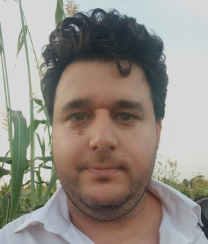
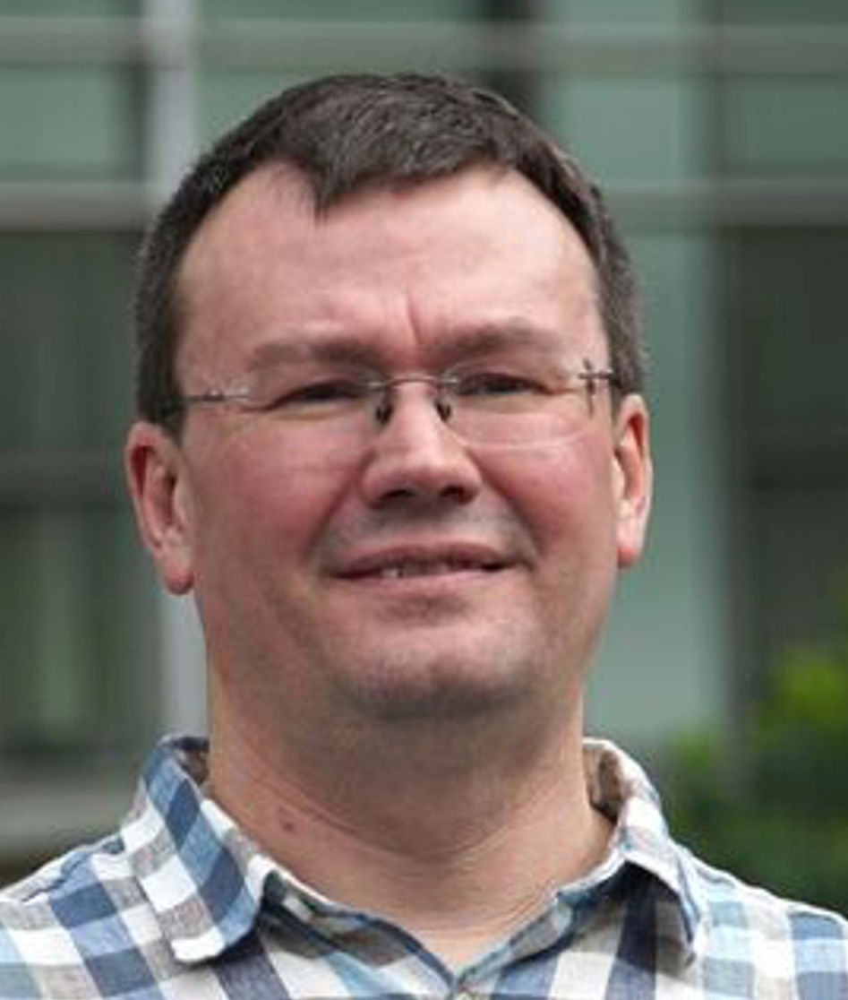
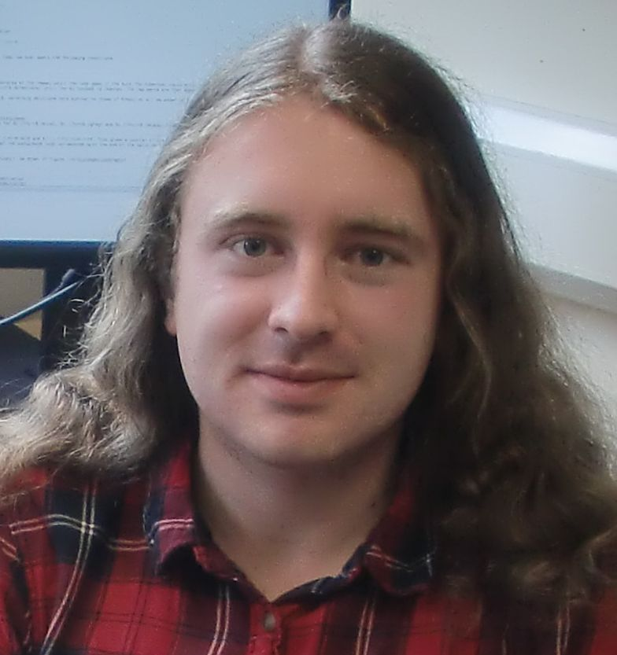
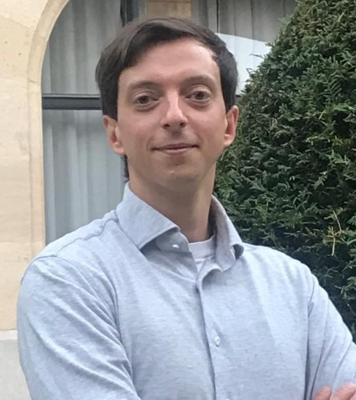

## STACK International Advisory Board

The International Advisory Board encourages engagement from the community of users of the STACK
online assessment system and helps to oversee strategic developments of
the system. The Advisory Board promotes the long-term stainability of the software and invites
contributions from diverse stakeholders.

 

	

    

    	

 
    	<h4>Meike Akveld</h4>
    	
ETH Zürich <a href="mailto:akveld@math.ethz.ch">akveld@math.ethz.ch</a> <em></em>

    

    

    	

 
    	<h4>Ian Jones</h4>
    	
Department of Mathematics Education, Loughborough University <a href="mailto:I.Jones@lboro.ac.uk">I.Jones@lboro.ac.uk</a> <em></em>

    

    

    	

 
    	<h4>David Stern</h4>
    	
IDEMS International <a href="mailto:d.a.stern@idems.international">d.a.stern@idems.international</a> <em></em>

    

  

	

    

    	

 
    	<h4>Michael Obiero Oyengo</h4>
    	
Masseno University, Kenya <a href="mailto:obiero@maseno.ac.ke">obiero@maseno.ac.ke</a> 
           <em>Chairperson of the 2026 conference</em>
    

    

    	

 
    	<h4>Antti Rasila</h4>
    	
Guangdong Technion-Israel Institute of Technology <a href="mailto:antti.rasila@gtiit.edu.cn">antti.rasila@gtiit.edu.cn</a> <em>Founder of the Abacus Consortium</em>

    

    

    	

 
    	<h4>Morten Brekke</h4>
    	
University of Agder <a href="mailto:morten.brekke@uia.no">morten.brekke@uia.no</a>

    

  

	

    

    	

 
    	<h4>Tim.Lowe</h4>
    	
The Open University, UK <a href="mailto:tim.lowe@open.ac.uk">tim.lowe@open.ac.uk</a> <em></em>

    

    

    	

 
    	<h4>Michael Weinmann</h4>
    	
Ostbayerische Technische Hochschule (OTH) Amberg-Weiden <a href="mailto:m.weinmann@oth-aw.de">m.weinmann@oth-aw.de</a> 
        <em>Chairperson of the 2024 conference</em>

    

    

    	

 
    	<h4>Katja Dechant-Herrera</h4>
    	
Ostbayerische Technische Hochschule (OTH) Amberg-Weiden <a href="mailto:k.dechant@oth-aw.de">k.dechant@oth-aw.de</a> <em></em>

    

  

	

    

    	

 
    	<h4>Oksana Labanova</h4>
    	
TTK University of Applied Sciences <a href="mailto:oksana.labanova@tktk.ee">oksana.labanova@tktk.ee</a> <em>Chairperson of the 2023 conference</em>

    

    

    	

 
    	<h4>Michael Kallweit</h4>
    	
Ruhr-Universität Bochum <a href="mailto:michael.kallweit@rub.de">michael.kallweit@rub.de</a>

    

   	

   		

 
   		<h4>Maciej Matuszewski</h4>
   		
Durham University, UK <a href="mailto:m.t.matuszewski@durham.ac.uk">m.t.matuszewski@durham.ac.uk</a> 
           <em>Chairperson of the 2025 conference</em>

   	

    

	

    

    	

 
    	<h4>Michael Crocco</h4>
    	
Monash University <a href="mailto:michael.crocco@monash.edu">michael.crocco@monash.edu</a>

    

    

    	

 
    	<h4>Danilo Lewanski</h4>
    	
University of Trieste <a href="mailto:DANILO.LEWANSKI@units.it">DANILO.LEWANSKI@units.it</a>

    

    

    	

 
    	<h4>Yasuyuki Nakamura</h4>
    	
名古屋大学 / Nagoya University <a href="mailto:nakamura.yasuyuki.f1@f.mail.nagoya-u.ac.jp">nakamura.yasuyuki.f1@f.mail.nagoya-u.ac.jp</a>

    

    

