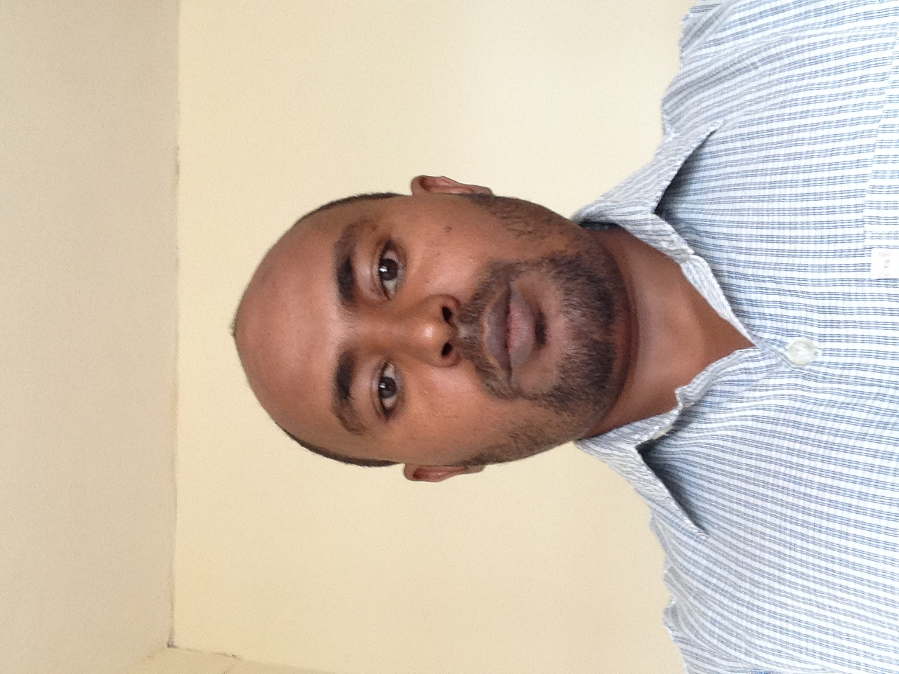
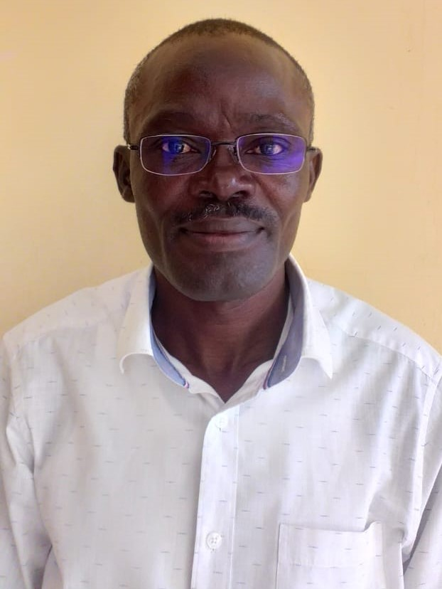
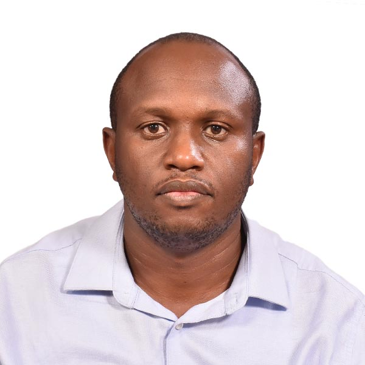
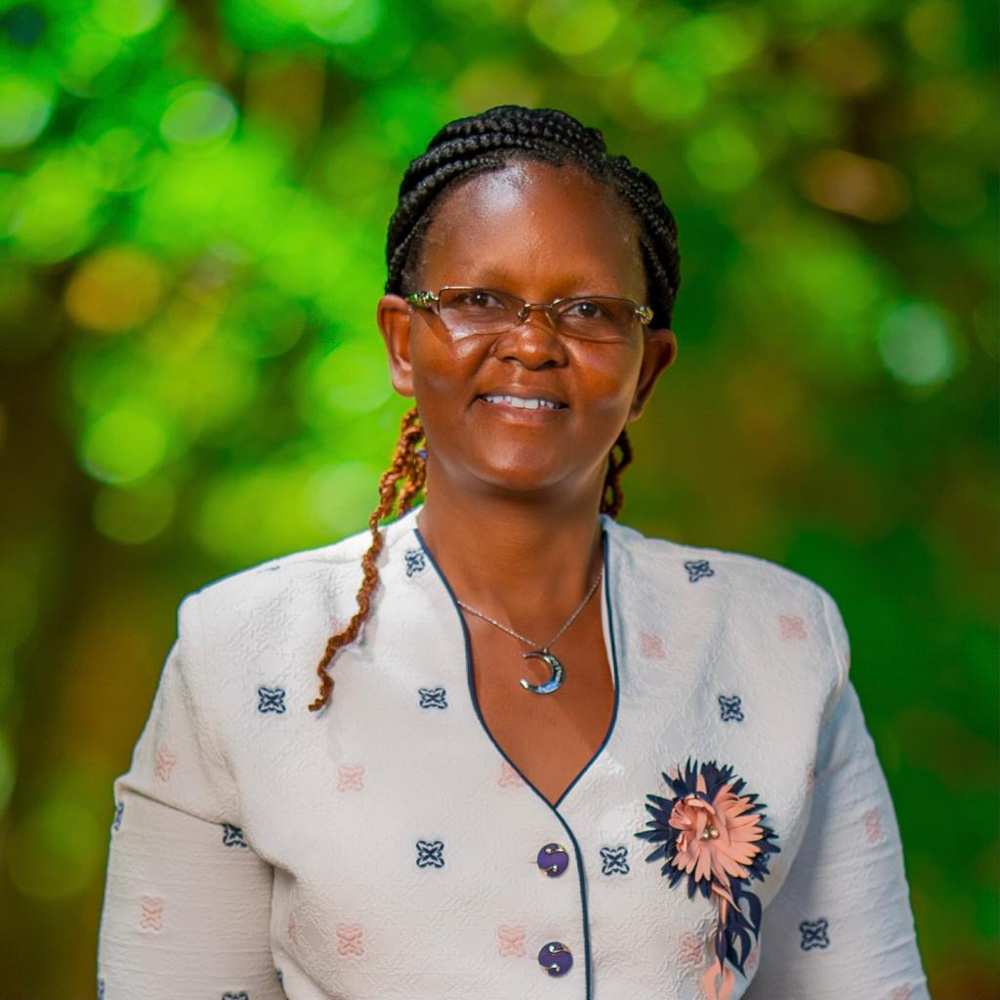

# The African STACK Community Leadership Team

The African STACK Community Leadership Team was created in response to the need for a concerted effort to drive STACK integration in African institution forwards during <a href="/CaseStudies/2023/African_STACK_Conference_2023/">The First African STACK Conference for Undergraduate Mathematics</a>.

	

		

			 
			<h4>Dr Michael Obiero Oyengo</h4>
			

				Maseno University, Kenya 
				<a href="mailto:obiero@maseno.ac.ke">obiero@maseno.ac.ke</a> 
				<em>Team Leader</em>
			

		

    

    

        

			 
			<h4>Dr Beth	Kiratu</h4>
			

				Technical University of Kenya and Kenya Mathematics Society, Kenya 
				<a href="mailto:beth.kiratu@tukenya.ac.ke">beth.kiratu@tukenya.ac.ke</a> 
				<em>Kenya Mathematics Society Representative</em>
			

		

        

			 
			<h4>Dr Mary Achieng</h4>
			

				Strathmore University, Kenya 
				<a href="mailto:machieng@strathmore.edu">machieng@strathmore.edu</a> 
				<em>African STACK Conferences Lead</em>
			

		

        

			 
			<h4>Prof Martin Mugochi</h4>
			

				University of Namibia, Namibia 
				<a href="mailto:martinmugochi@gmail.com">martinmugochi@gmail.com</a> 
				<em>Namibia STACK Representative</em>
			

		

  	

    

        

			 
			<h4>Dr Idrissa Said Amour</h4>
			

				University of Dar es Salaam, Tanzania 
				<a href="mailto:idrissaamour@gmail.com">idrissaamour@gmail.com</a> 
				<em>Tanzania STACK Representative</em>
			

		

        

			 
			<h4>Dr Abdu Mohammed Seid</h4>
			

				Bahir Dar University, Ethiopia 
				<a href="mailto:abdum442@yahoo.com">abdum442@yahoo.com</a> 
				<em>Ethiopia STACK Representative</em>
			

		

        

			 
			<h4>Prof George Lawi</h4>
			

				Masinde Muliro University of Science and Technology, Kenya 
				<a href="mailto:glawi@mmust.ac.ke">glawi@mmust.ac.ke</a> 
				<em>Institutionalization of STACK at African Universities</em>
			

		

  	

        

        

			 
			<h4>Dr Herine Otieno</h4>
			

				IDEMS International, Rwanda 
				<a href="mailto:herine.otieno@idems.international">herine.otieno@idems.international</a> 
				<em>STACK Research agenda in African Institutions</em>
			

		

        

			 
			<h4>Dr James Kaleli Musyoka</h4>
			

				Maseno University, Kenya 
				<a href="mailto:jkmusyoka@maseno.ac.ke">jkmusyoka@maseno.ac.ke</a> 
				<em>STACK for Statistics and Data Science</em>
			

		

        

			 
			<h4>Dr Annette Wakaanya Okoth</h4>
			

				Masinde Muliro University of Science and Technology, Kenya 
				<a href="mailto:aokoth@mmust.ac.ke">aokoth@mmust.ac.ke</a> 
				<em>STACK for Statistics Integration</em>
			

		

  	

        

        

			 
			<h4>Dr Jared Ongaro</h4>
			

				University of Nairobi, Kenya 
				<a href="mailto:ongaro@uonbi.ac.ke">ongaro@uonbi.ac.ke</a> 
				<em>Policy and Implementation Agenda</em>
			

		

  	

