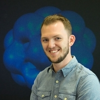
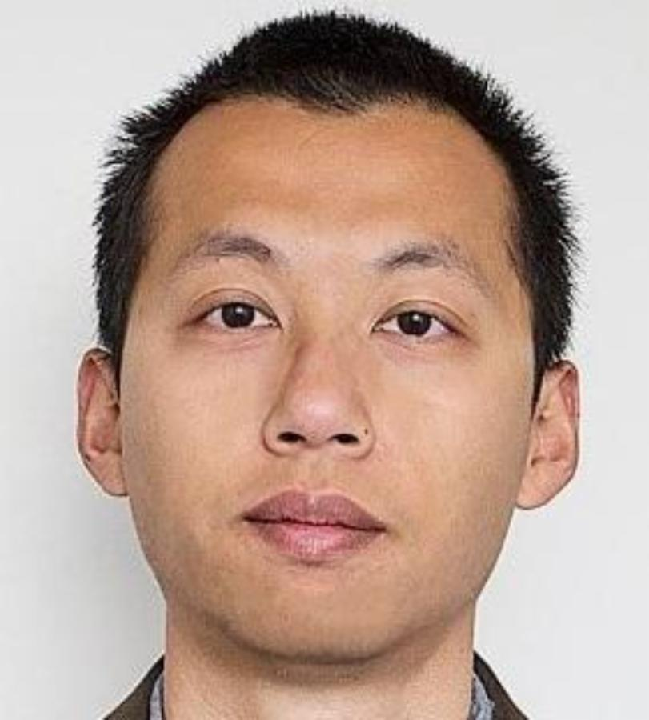

## STACK Professionals Network

The STACK Professionals Network was established during the summer of 2022 to bring together early career professionals (not necessarily academics), across various institutions, who spend a significant amount of their time authoring STACK questions. Authoring STACK questions requires specialist skills, and the people who do this job somtimes work in relative isolation in their institutions. They may not have much help regarding various issues that they encounter authoring questions. The Network will help the STACK professionals to solve various authoring difficulties and also make it easier to share existing questions/quizzes. Furthermore, the Network can provide training to colleagues who are new into STACK and define the pedagogy around creating STACK questions.

To join the Network come in contact with Chris Sangwin: <a href="mailto:c.j.sangwin@ed.ac.uk">c.j.sangwin@ed.ac.uk</a> or Konstantina Zerva: <a href="mailto:k.zerva@ed.ac.uk">k.zerva@ed.ac.uk</a>.

To contact the Network: <a href="mailto:network_stack_prof@mlist.is.ed.ac.uk">network_stack_prof@mlist.is.ed.ac.uk</a>.

	

    	

    		

 
    		<h4>Konstantina Zerva</h4>
    		
The University of Edinburgh, UK <a href="mailto:k.zerva@ed.ac.uk">k.zerva@ed.ac.uk</a> <em></em>

    	

    	

    		

 
    		<h4>George-Ionut Ionita</h4>
    		
ETH Zürich <a href="mailto:georgeionut.ionita@math.ethz.ch">georgeionut.ionita@math.ethz.ch</a> <em></em>

    	

    	

    		

 
    		<h4>Andreas Steiger</h4>
    		
ETH Zürich <a href="mailto:andreas.steiger@math.ethz.ch">andreas.steiger@math.ethz.ch</a> <em></em>

    	

  	

	

    	

    		

 
    		<h4>Maciej Matuszewski</h4>
    		
Durham University, UK <a href="mailto:m.t.matuszewski@durham.ac.uk">m.t.matuszewski@durham.ac.uk</a> <em></em>

    	

		

    		

 
    		<h4>Sam Fearn</h4>
    		
Durham University, UK <a href="mailto:s.m.fearn@durham.ac.uk">s.m.fearn@durham.ac.uk</a> <em></em>

    	

		

    		

 
    		<h4>Santiago Borio</h4>
    		
IDEMS International, UK <a href="mailto:smborio@idems.international">smborio@idems.international</a> <em></em>

    	

    

	

		

    		

 
    		<h4>Georg Osang</h4>
    		
IDEMS International, UK <a href="mailto:gosang@idems.international">gosang@idems.international</a> <em></em>

		

		

    		

 
    		<h4>Kinga Sipos</h4>
    		
Bern University, Switzerland  <a href="kinga.sipos@unibe.ch">kinga.sipos@unibe.ch</a> <em></em>

    		

		

    		

 
    		<h4>Luke Longworth</h4>
    		
University of Canterbury, New Zealand <a href="mailto:luke.longworth@canterbury.ac.nz">luke.longworth@canterbury.ac.nz</a> <em></em>

    	

	

	

		

    		

 
    		<h4>Speedy Jiang</h4>
    		
University of Canterbury, New Zealand <a href="mailto:speedy.jiang@canterbury.ac.nz">speedy.jiang@canterbury.ac.nz</a> <em></em>

    	

		

    		

 
    		<h4>Ruth Reynolds</h4>
    		
University College London, UK <a href="mailto:ruth.reynolds@ucl.ac.uk">ruth.reynolds@ucl.ac.uk</a> <em></em>

    	

		

    		

 
    		<h4>Stephen Nulty</h4>
		

	

	

		

   			

 
   			<h4>Markus Orthaber</h4>
   			
Montanuniversität Leoben, Austria <a href="mailto:markus.orthaber@unileoben.ac.at">markus.orthaber@unileoben.ac.at</a> <em></em>

   		

		

   			

 
   			<h4>Stefanie Zegowitz</h4>
   			
TU Clausthal, Germany <a href="zegowitz@rz.tu-clausthal.de">zegowitz@rz.tu-clausthal.de</a> <em></em>

   		

		

   			

 
   			<h4>Chris Nelson</h4>
   			
The Open University, UK <a href="chris.nelson@open.ac.uk">chris.nelson@open.ac.uk</a> <em></em>

		

	

	

		

   			

 
   			<h4>Juma Zevick</h4>
   			
University of Trieste, Italy <a href="mailto:ZEVICKOTIENO.JUMA@phd.units.it">zevickotieno.juma@phd.units.it</a> <em></em>

   		

		

   			

 
   			<h4>Alex Fowler</h4>
   			
The University of Otago, New Zealand <a href="mailto:alex.fowler@otago.ac.nz">alex.fowler@otago.ac.nz</a> <em></em>

   		

		

   			

 
   			<h4>Jonas Lache</h4>
   			
Hochschule Ruhr West and Ruhr-Universität Bochum, Germany <a href="mailto:jonas.lache@hs-ruhrwest.de">jonas.lache@hs-ruhrwest.de</a> <em></em>

   		

	

	

		

   			

 
   			<h4>Wigand Rathmann</h4>
   			
 Friedrich-Alexander-Universität Erlangen-Nürnberg (FAU), Germany <a href="mailto:wigand.rathmann@fau.de">wigand.rathmann@fau.de</a> <em></em>

   		

		

    		

 
    		<h4>Hendrikje Schmidtpott</h4>
    		
 Universität Kassel, Departement of Mathematics, Diskrete Mathematics and Algebra, Germany <a href="mailto:hendrikje.schmidtpott@mathematik.uni-kassel.de">hendrikje.schmidtpott@mathematik.uni-kassel.de</a> <em></em>

    	

		

   			

 
   			<h4>Motognon Wastalas Dogbalou</h4>
   			
University of Trieste, Italy <a href="mailto:motognonwastalasd'assise.dogbalou@phd.units.it">motognonwastalasd'assise.dogbalou@phd.units.it</a> <em></em>

   		

        

		

		

   			

 
   			<h4>Oleg Boruch Ioffe</h4>
   			
 h² - Hochschule Magdeburg-Stendal, Fachbereich Wasser, Umwelt, Bau und Sicherheit, Germany <a href="mailto:oleg-boruch.ioffe@h2.de">oleg-boruch.ioffe@h2.de</a>

   		

		

   			

 
   			<h4>Hayden Maudsley-Barton</h4>
   			
The University of Edinburgh, UK <a href="mailto:hamaudsle@ed.ac.uk">hmaudsle@ed.ac.uk</a>

   		

		

   			

 
   			<h4>Michele Pancera</h4>
   			
<a href="mailto:michelepancera@gmail.com">michelepancera@gmail.com</a>

   		

		

		

		

   			

 
   			<h4>Matthias Geissbühler</h4>
   			
Berufsmaturitätsschule Zürich, Switzerland 
            <a href="mailto:matthias.geissbuehler@bms-zuerich.ch">matthias.geissbuehler@bms-zuerich.ch</a>

   		

		

   			

 
   			<h4>Miriam Weigel</h4>
   			
DHBW Mannheim, Germany <a href="mailto:Miriam.Weigel@dhbw.de">Miriam.Weigel@dhbw.de</a>

   		

		

   			

 
   			<h4>Florian Lindemann</h4>
   			
Technische Universität München, Germany <a href="mailto:lindemann@cit.tum.de">lindemann@cit.tum.de</a>

   		

    	

	

