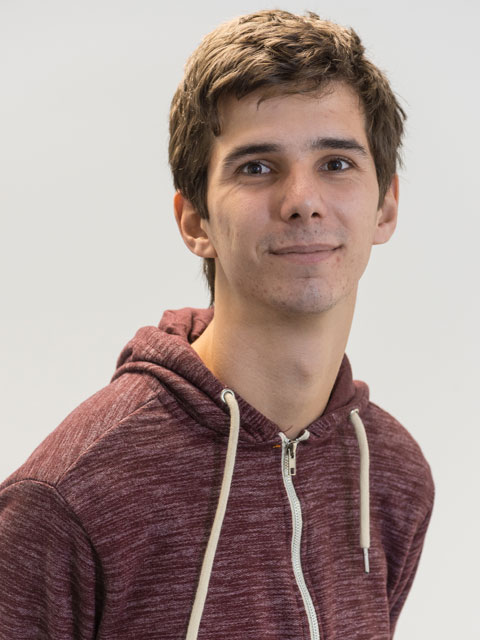
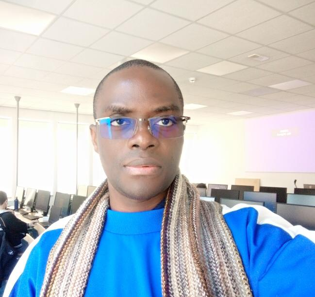

<link rel="stylesheet" href="../../pubs.css" />

# STACK Researchers Network

The STACK Researchers Network brings together education researchers with an interest in computer-aided assessment tools such as STACK.

The range of topics for research involving STACK is very broad. A recent collaborative project to develop a research agenda for e-assessment in undergraduate mathematics has identified 55 research questions, many of which are relevant to STACK:

 * [https://maths.github.io/e-assessment-research-agenda/](https://maths.github.io/e-assessment-research-agenda/)

 * Kinnear, G., Jones, I., Sangwin, C., Alarfaj, M., Davies, B., Fearn, S., Foster, C., Heck, A., Henderson, K., Hunt, T., Iannone, P., Kontorovich, I., Larson, N., Lowe, T., Meyer, J. C., O’Shea, A., Rowlett, P., Sikurajapathi, I., & Wong, T. (2024). A collaboratively-derived research agenda for E-assessment in undergraduate mathematics. _International Journal of Research in Undergraduate Mathematics Education, 10_(1), 201–231. <https://doi.org/10.1007/s40753-022-00189-6>

The STACK Researchers Network aims to:

* Support the development of new research projects related to STACK, by stimulating interaction between researchers and other professionals using STACK.
* Provide support for colleagues who are seeking to develop skills in education research related to STACK.
* Promote research outcomes from studies involving STACK.

If you would like to join the Network, please 

* join the [dedicated channel on the STACK project's Zulip chat](https://stack-assessment.zulipchat.com/#narrow/channel/481216-STACK-Researchers-Network), and
* contact George Kinnear (<a href="mailto:G.Kinnear@ed.ac.uk">G.Kinnear@ed.ac.uk</a>) to add your details to this page.

## Members

	

    

		<h4>Dr George Kinnear</h4>
		
The University of Edinburgh, UK 
		  <a href="mailto:G.Kinnear@ed.ac.uk">G.Kinnear@ed.ac.uk</a> 
		  <em>Network Organiser</em>
		

		
Interests:
			Course design
			Example-generation tasks
		

	

	

	

    

		<h4>Prof Meike Akveld</h4>
		
ETH Zürich, Switzerland 
		  <a href="mailto:meike.akveld@math.ethz.ch">meike.akveld@math.ethz.ch</a>
		

		
Interests:
			Course design
			Task design
			E-assessment
		

	

	

    

		<h4>Dr Ben Davies</h4>
		
Uniersity of Southampton, UK 
		  <a href="mailto:Ben.Davies@soton.ac.uk">Ben.Davies@soton.ac.uk</a>
		

		
Interests:
			Proof
			Feedback
		

	

	

    

		<h4>Dr Joe Champion</h4>
		
Boise State University, USA 
		  <a href="mailto:JoeChampion@boisestate.edu">JoeChampion@boisestate.edu</a>
		

		
Interests:
			Effects of implementation
		

	

	

    

		<h4>Prof Ian Jones</h4>
		
Loughborough University, UK 
		  <a href="mailto:I.Jones@lboro.ac.uk">I.Jones@lboro.ac.uk</a>
		

		
Interests:
			Feedback
		

	

	

    

		<h4>Dr Laura Kobel-Keller</h4>
		
ETH Zürich, Switzerland 
		  <a href="mailto:laura.kobel-keller@math.ethz.ch">laura.kobel-keller@math.ethz.ch</a>
		

		
Interests:
			Proof
			PDEs
			Student's perspective and experience
			Digital exams
		

	

	

    

		<h4>Dr Herine Otieno</h4>
		
EduHubAfric, Rwanda / Education Development Trust, UK 
		  <a href="mailto:herine.otieno@idems.international">herine.otieno@idems.international</a>
		

		
Interests:
			Adaptive learning
			Equity
			STACK-supported flipped teaching
		

	

	

    

		<h4>Prof Chris Sangwin</h4>
		
The University of Edinburgh, UK 
		  <a href="mailto:C.J.Sangwin@ed.ac.uk">C.J.Sangwin@ed.ac.uk</a>
		

		
Interests:
			Educational Technology
			Task Design
		

	

	

    

		<h4>Dr Andreas Steiger</h4>
		
ETH Zürich, Switzerland 
		  <a href="mailto:andreas.steiger@math.ethz.ch">andreas.steiger@math.ethz.ch</a>
		

		
Interests:
			Teaching for large class sizes
			Calculus for engineers
		

	

	

    

		<h4>Motognon-Wastalas-Dogbalou</h4>
		
University of Trieste, Italy 
		  <a href="mailto:motognonwastalasd'assise.dogbalou@phd.units.it">motognonwastalasd'assise.dogbalou@phd.units.it</a>
		

		
Interests:
			Adaptive quizzes
			Common student errors
		

	

	

    

		<h4>Juma Zevick</h4>
		
University of Trieste, Italy 
		  <a href="mailto:zevickotieno.juma@phd.units.it">zevickotieno.juma@phd.units.it</a>
		

		
Interests:
			Feedback
		

	

## Research publications

Many of the following studies were carried out by members of the Researchers Network.

  <!-- Shown only when JavaScript is unavailable -->
  <noscript id="stack-pubs-fallback">
    

      <a href="https://github.com/maths/moodle-qtype_stack/blob/master/doc/content/stack_publications.pdf" class="btn btn-primary btn-lg">
        <i class="fa-regular fa-file-lines"></i> List of publications related to STACK
      </a>
    

  </noscript>

  <!-- Hidden by CSS until JS reveals it after a successful load -->
  

    <input type="search" id="pub-search"
           placeholder="Search publications by author, title, year…"
           autocomplete="off" spellcheck="false">
    

  

  <!-- Left empty in HTML; JS either fills it or shows the fallback link -->
  

<!-- Bundled citation.js (core + bibtex + csl plugins). Pinned for stability. -->

