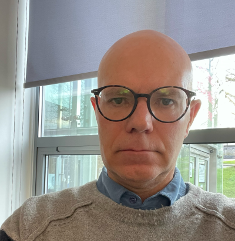

# STACK Researchers Network

The STACK Researchers Network brings together education researchers with an interest in computer-aided assessment tools such as STACK.

The range of topics for research involving STACK is very broad. A recent collaborative project to develop a research agenda for e-assessment in undergraduate mathematics has identified 55 research questions, many of which are relevant to STACK:

 * [https://maths.github.io/e-assessment-research-agenda/](https://maths.github.io/e-assessment-research-agenda/)

 * Kinnear, G., Jones, I., Sangwin, C., Alarfaj, M., Davies, B., Fearn, S., Foster, C., Heck, A., Henderson, K., Hunt, T., Iannone, P., Kontorovich, I., Larson, N., Lowe, T., Meyer, J. C., O’Shea, A., Rowlett, P., Sikurajapathi, I., & Wong, T. (2024). A collaboratively-derived research agenda for E-assessment in undergraduate mathematics. _International Journal of Research in Undergraduate Mathematics Education, 10_(1), 201–231. <https://doi.org/10.1007/s40753-022-00189-6>

The STACK Researchers Network aims to:

* Support the development of new research projects related to STACK, by stimulating interaction between researchers and other professionals using STACK.
* Provide support for colleagues who are seeking to develop skills in education research related to STACK.
* Promote research outcomes from studies involving STACK.

If you would like to join the Network, please 

* join the [dedicated channel on the STACK project's Zulip chat](https://stack-assessment.zulipchat.com/#narrow/channel/481216-STACK-Researchers-Network), and
* contact George Kinnear (<a href="mailto:G.Kinnear@ed.ac.uk">G.Kinnear@ed.ac.uk</a>) to add your details to this page.

## Members

	

    

		<h4>Dr George Kinnear</h4>
		
The University of Edinburgh, UK 
		  <a href="mailto:G.Kinnear@ed.ac.uk">G.Kinnear@ed.ac.uk</a> 
		  <em>Network Organiser</em>
		

		
Interests:
			Course design involving STACK
			Example-generation tasks
		

	

	

	

    

		<h4>Prof Meike Akveld</h4>
		
ETH Zürich, Switzerland 
		  <a href="mailto:meike.akveld@math.ethz.ch">meike.akveld@math.ethz.ch</a>
		

		
Interests:
			Course design
			Task design
			E-assessment
		

	

	

    

		<h4>Dr Ben Davies</h4>
		
Uniersity of Southampton, UK 
		  <a href="mailto:Ben.Davies@soton.ac.uk">Ben.Davies@soton.ac.uk</a>
		

		
Interests:
			Proof
			Feedback
		

	

	

    

		<h4>Dr Joe Champion</h4>
		
Boise State University, USA 
		  <a href="mailto:JoeChampion@boisestate.edu">JoeChampion@boisestate.edu</a>
		

		
Interests:
			Effects of implementation
		

	

	

    

		<h4>Prof Ian Jones</h4>
		
Loughborough University, UK 
		  <a href="mailto:I.Jones@lboro.ac.uk">I.Jones@lboro.ac.uk</a>
		

		
Interests:
			Feedback
		

	

	

    

		<h4>Dr Herine Otieno</h4>
		
EduHubAfric, Rwanda / Education Development Trust, UK 
		  <a href="mailto:herine.otieno@idems.international">herine.otieno@idems.international</a>
		

		
Interests:
			Adaptive learning
			Equity
			STACK-supported flipped teaching
		

	

	

    

		<h4>Prof Chris Sangwin</h4>
		
The University of Edinburgh, UK 
		  <a href="mailto:C.J.Sangwin@ed.ac.uk">C.J.Sangwin@ed.ac.uk</a>
		

		
Interests:
			Educational Technology
			Task Design
		

	

	

    

		<h4>Dr Andreas Steiger</h4>
		
ETH Zürich, Switzerland 
		  <a href="mailto:andreas.steiger@math.ethz.ch">andreas.steiger@math.ethz.ch</a>
		

		
Interests:
			Teaching for large class sizes
			Calculus for engineers
		

	

	

    

		<h4>Motognon-Wastalas-Dogbalou</h4>
		
University of Trieste, Italy 
		  <a href="mailto:motognonwastalasd'assise.dogbalou@phd.units.it">motognonwastalasd'assise.dogbalou@phd.units.it</a>
		

		
Interests:
			Adaptive quizzes
			Common student errors
		

	

	

    

		<h4>Juma Zevick</h4>
		
University of Trieste, Italy 
		  <a href="mailto:zevickotieno.juma@phd.units.it">zevickotieno.juma@phd.units.it</a>
		

		
Interests:
			Feedback
		

	

## Research publications

Members of the STACK Researchers Network have contributed to the following studies related to STACK:

* Davies, B., Crisan, C., Geraniou, E., & Smart, T. (2024). A Department-Wide Transition to a New Mode of Computer-Aided Assessment Using STACK. _International Journal of Research in Undergraduate Mathematics Education_. <https://doi.org/10.1007/s40753-024-00251-5>s

* Kinnear, G. (2024). Comparing example generation with classification in the learning of new mathematics concepts. _Research in Mathematics Education, 26_(1), 109–132. <https://doi.org/10.1080/14794802.2022.2152086>

* Kinnear, G., Iannone, P., & Davies, B. (2024). Student approaches to generating mathematical examples: Comparing e-assessment and paper-based tasks. _Educational Studies in Mathematics_. <https://doi.org/10.1007/s10649-024-10361-1>

* Kinnear, G., Jones, I., Sangwin, C., Alarfaj, M., Davies, B., Fearn, S., Foster, C., Heck, A., Henderson, K., Hunt, T., Iannone, P., Kontorovich, I., Larson, N., Lowe, T., Meyer, J. C., O’Shea, A., Rowlett, P., Sikurajapathi, I., & Wong, T. (2024). A collaboratively-derived research agenda for E-assessment in undergraduate mathematics. _International Journal of Research in Undergraduate Mathematics Education, 10_(1), 201–231. <https://doi.org/10.1007/s40753-022-00189-6>

* Kinnear, G., Wood, A. K., & Gratwick, R. (2022). Designing and evaluating an online course to support transition to university mathematics. _International Journal of Mathematical Education in Science and Technology, 53_(1), 11–34. <https://doi.org/10.1080/0020739X.2021.1962554>

* Sangwin, C. J. (2013). Computer Aided Assessment of Mathematics, Oxford University Press (ISBN 978-0-19-966035-3)

Further examples of research related to STACK can be found in the [list of STACK publications](https://docs.stack-assessment.org/content/stack_publications.pdf).

## Meeting notes

Notes from our regular meetings are available on the [archive of meeting reports](/MeetingReports).

