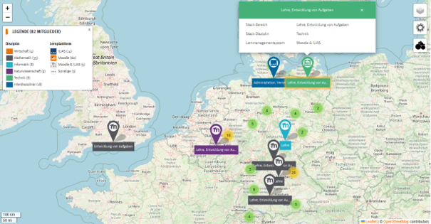
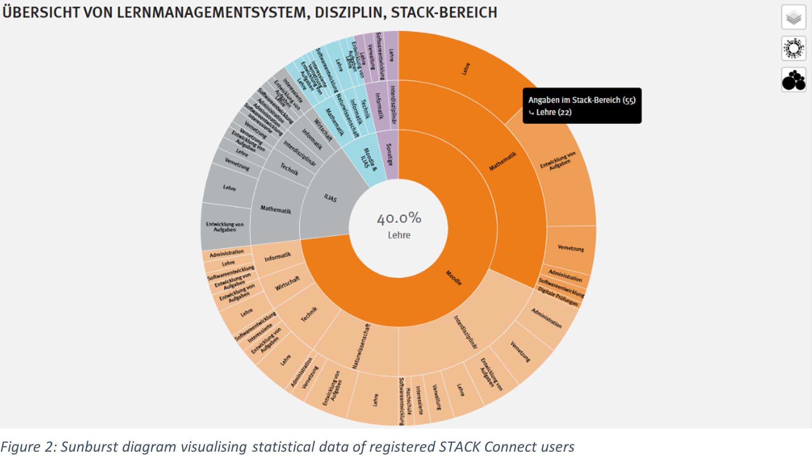
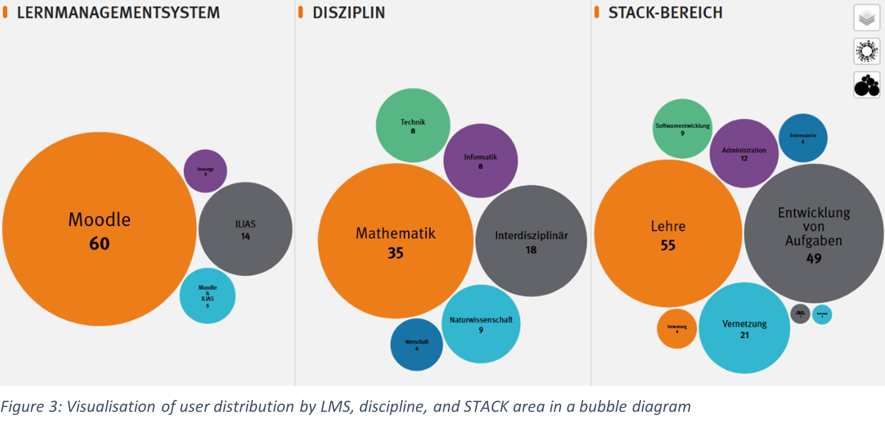

# STACK Connect: Network for the German-speaking STACK Community

Launched in autumn 2024, [STACK Connect](https://stack-connect.oth-aw.de/) is a digital networking platform designed to connect STACK users across German-speaking countries. Its primary goal is to foster professional exchange, support cross-institutional collaboration, and enable targeted networking.

Developed with funding from the [Innovation in Higher Education Foundation](https://stiftung-hochschullehre.de/projekt/stack-net/) and sustained by the [Service Center Digitale Aufgaben](https://www.oth-aw.de/hochschule/services/service-center-digitale-aufgaben/ueber-uns/) at OTH Amberg-Weiden, STACK Connect supports the structured growth of a sustainable **community of practice**.

In this report, we present the key features of STACK Connect and demonstrate how the platform simplifies access to the community and encourages dialogue within the higher education landscape.

At the core of the platform is an **interactive homepage** where users can create profiles, showcase areas of expertise, and find relevant contacts. This is complemented by a **regular newsletter** featuring updates on current developments, events, and proven STACK use cases.

**The STACK Connect map** (Fig. 1) visualises existing focus areas and supports the formation of thematically and regionally focused networks. Users can create a profile, define their professional interests, and make themselves visible within the community. 

<figure class="figure">

  <figcaption class="figure-caption">Fig 1: STACK Connect – interactive website for enabling networking and collaboration in the STACK community.</figcaption>
</figure>

A wide range of filter options makes it easy to find relevant contacts, for example by:
- University and location
- Learning management system (e.g. Moodle, ILIAS)
- Type of STACK use (e.g. teaching)
- Role (e.g. lecturer)

In addition to the map, registered users have access to two further interactive visualisations: The sunburst diagram (Fig. 2) provides a quick overview of structures and frequencies within the community. It shows, for example, which disciplines are particularly strongly represented in which STACK context - such as maths teaching at Moodle-based universities.

<figure class="figure">

  <figcaption class="figure-caption">Fig 2: Sunburst diagram visualising statistical data of registered STACK Connect users.</figcaption>
</figure>

In addition, the **bubble diagram** (Fig. 3) visualises the distribution of users across three key categories: 1) **Learning Management System**, 2) **discipline**, and 3) **STACK area**. This makes it easy to identify thematic priorities and institutional clusters at a glance.

<figure class="figure">

  <figcaption class="figure-caption">Fig 3: Visualisation of user distribution by LMS, discipline, and STACK area in a bubble diagram.</figcaption>
</figure>

Both visualisations help users navigate the platform—especially newcomers—and provide a data-driven foundation for topic-specific networking and collaboration.

**STACK Connect** is hosted as a subdomain of OTH Amberg-Weiden and operates under its data protection and IT security policies. The platform meets current data security standards in the higher education sector.

Whether you are a teacher, developer, or administrator—already working with STACK or just getting started:

[Click here to register](https://stack-connect.oth-aw.de/registrierung/)

**Contact**   
Prof. Dr. Mike Altieri     
E-Mail: <stack@oth-aw.de>

