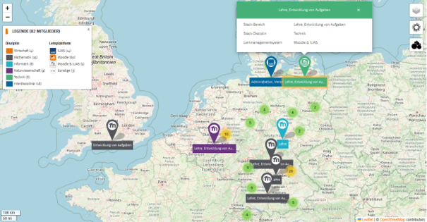
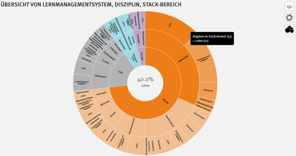
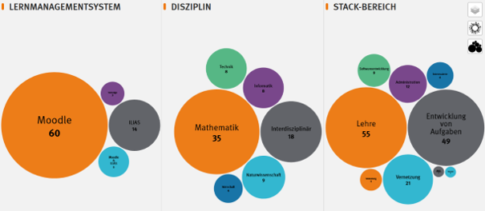

# STACK Connect: Netzwerk für die deutschsprachige STACK-Community

([Community information in English](STACK_Connect.md))

STACK Connect ist eine im Herbst 2024 gestartete digitale Vernetzungsplattform, die STACK-Nutzende im deutschsprachigen Raum miteinander verbindet. Ihr Hauptziel ist es, den fachlichen Austausch zu fördern, institutionsübergreifende Zusammenarbeit zu unterstützen und gezielte Netzwerkarbeit zu ermöglichen.

STACK Connect wird mit Förderung durch die Stiftung Innovation in der Hochschullehre entwickelt und durch das Service Zentrum Digitale Aufgaben an der OTH Amberg-Weiden getragen. Die Plattform unterstützt den strukturierten Aufbau einer nachhaltigen Community of Practice.

In diesem Bericht stellen wir die zentralen Funktionen von STACK Connect vor und zeigen, wie die Plattform den Zugang zur Community erleichtert und den Dialog in der Hochschullandschaft anregt.

Im Zentrum der Plattform steht eine interaktive Startseite, auf der Nutzende Profile anlegen, ihre Fachgebiete präsentieren und gezielt Kontakte finden können. Ergänzt wird dies durch einen regelmäßigen Newsletter mit aktuellen Informationen, Veranstaltungshinweisen und bewährten Anwendungsbeispielen für STACK.

**Die STACK Connect-Karte** (Abb. 1) visualisiert bestehende Schwerpunkte der registrierten Mitglieder und unterstützt die Bildung thematisch und regional ausgerichteter Netzwerke. Nutzende können ein Profil erstellen, ihre fachlichen Interessen angeben und sich innerhalb der Community sichtbar machen.

<figure class="figure">

  <figcaption class="figure-caption">Abbildung 1: STACK Connect – interaktive Website zur Förderung der Vernetzung und Zusammenarbeit in der STACK-Gemeinschaft</figcaption>
</figure>

Eine Vielzahl von Filteroptionen erleichtert das Finden relevanter Kontakte, beispielsweise nach:
-	Hochschule und Standort
-	Learning Management System (z. B. Moodle, ILIAS)
-	Art der STACK-Nutzung (z. B. Lehre)
-	Rolle (z. B. Lehrende*r)

Zusätzlich zur Karte stehen registrierten Nutzenden zwei weitere interaktive Visualisierungen zur Verfügung: Das Sunburst-Diagramm (Abb. 2) bietet einen schnellen Überblick über Strukturen und Häufigkeiten innerhalb der Community. So ist beispielsweise erkennbar, welche Fachrichtungen in welchem STACK-Kontext besonders stark vertreten sind – etwa die Mathematiklehre an Moodle-basierten Hochschulen.

<figure class="figure">

  <figcaption class="figure-caption">Abbildung 2: Sunburst-Diagramm zur Visualisierung der statistischen Daten der registrierten STACK Connect-Nutzer</figcaption>
</figure>

Das **Bubble-Diagramm** (Abb. 3) veranschaulicht die Verteilung der Nutzenden anhand drei zentraler Kategorien: Learning Management System, Fachrichtung und STACK-Bereich. So lassen sich thematische Schwerpunkte und Cluster auf einen Blick erkennen.

<figure class="figure">

  <figcaption class="figure-caption">Abbildung 3: Visualisierung der Nutzerverteilung nach LMS, Disziplin und STACK-Bereich in einem Bubble-Diagramm.</figcaption>
</figure>

Beide Visualisierungen erleichtern die Orientierung auf der Plattform – insbesondere für Neueinsteigende – und bieten eine datengetriebene Grundlage für die Vernetzung und Zusammenarbeit.

STACK Connect wird als Subdomain der OTH Amberg-Weiden gehostet und unterliegt deren Datenschutz- sowie IT-Sicherheitsrichtlinien. Die Plattform entspricht den aktuellen Sicherheitsstandards im Hochschulbereich.

Egal ob Lehrende*r, Entwickler*in oder Administrator*in – ob Sie bereits mit STACK arbeiten oder neu einsteigen:

[Hier klicken zur Registrierung](https://stack-connect.oth-aw.de/registrierung/)

**Kontakt**   
Prof. Dr. Mike Altieri     
E-Mail: <stack@oth-aw.de>

