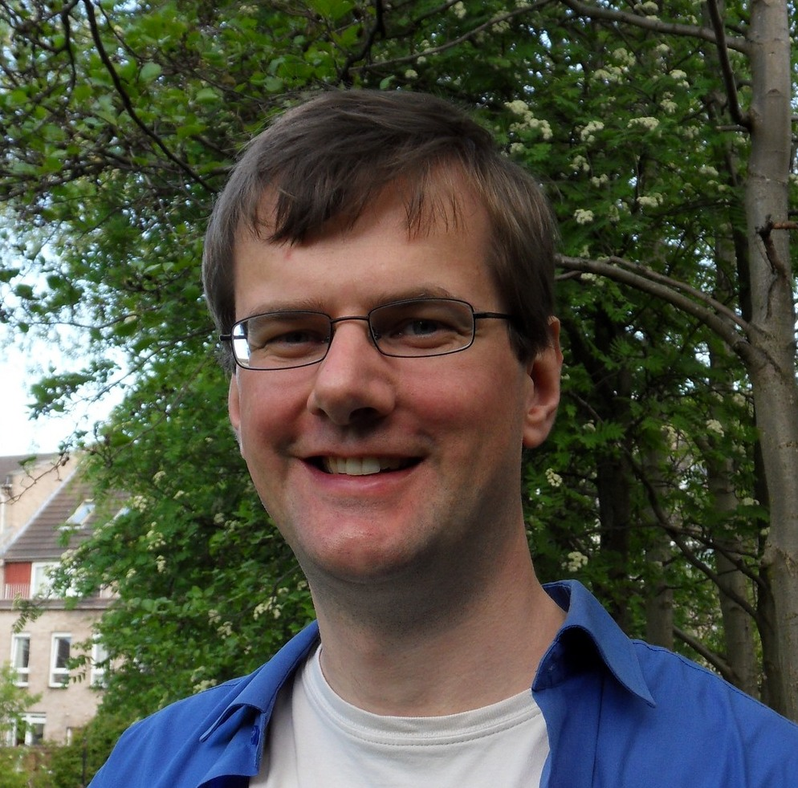
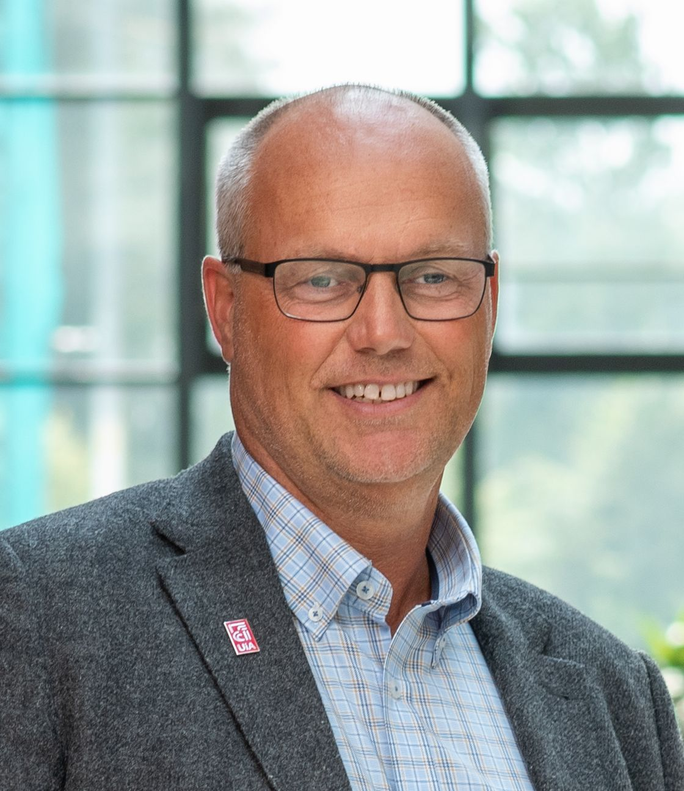
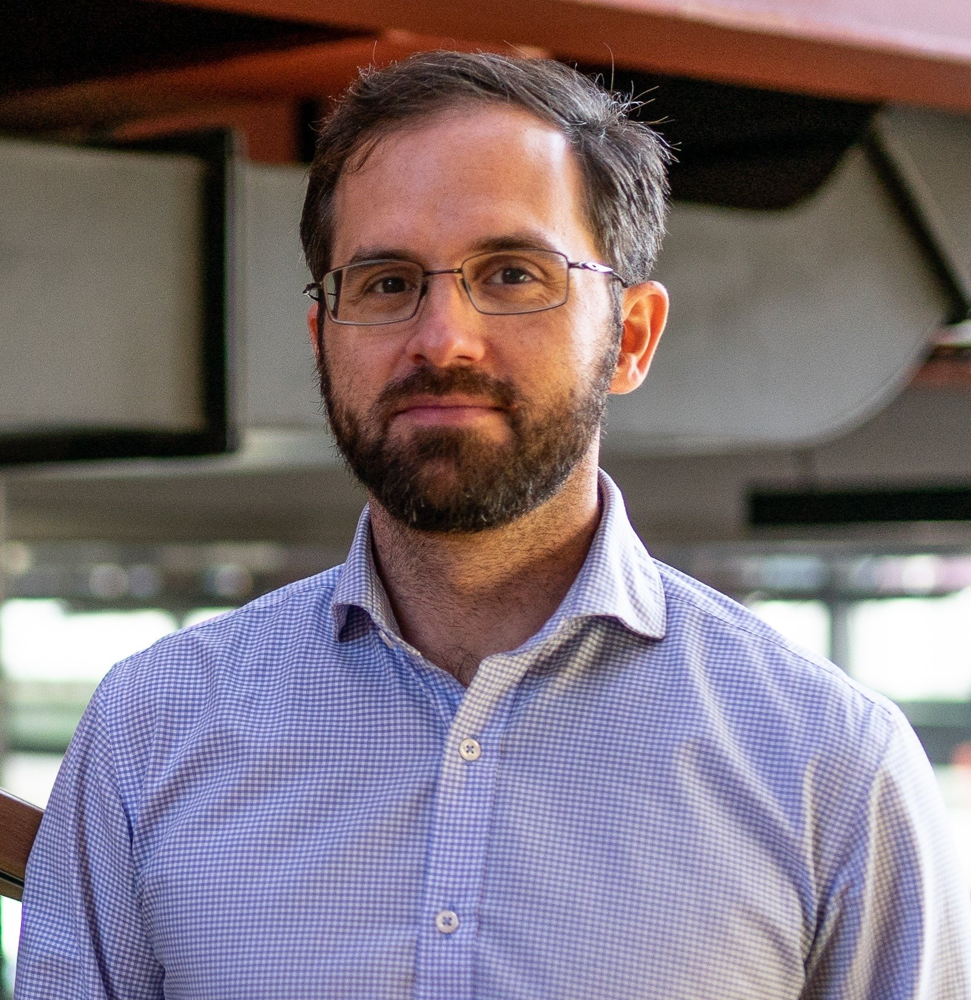

# Community

STACK has a very active user base, with a wide variety of colleagues in different roles.  Four particular groups are

1. The STACK Software Development Team;
2. The STACK International Advisory Board;
3. The [African STACK Community Leadership Team](Communities/African_leadership.md);
4. The [STACK Professionals Network](Communities/Professional_network.md).

The easiest way to engage with the community is through our <a href="https://stack-assessment.zulipchat.com/">free online chat platform</a>. All kinds of questions, suggestions and comments are welcome there.

## STACK Software Development Team

Continuously developed and used since 2004.

 

	

		

			 
			<h4>Chris Sangwin</h4>
			

				The University of Edinburgh, UK 
				<a href="mailto:C.J.Sangwin@ed.ac.uk">C.J.Sangwin@ed.ac.uk</a> 
				<em>Chairperson of the International Advisory Board</em>
			

		

    

	

		

			 
			<h4>Tim Hunt</h4>
			
The Open University, UK

		

		

			 
			<h4>Matti Harjula</h4>
			
Aalto, Finland

		

		

			 
			<h4>Jesús Copado</h4>
			

				SURLABS 
				<a href="mailto:jcopado@surlabs.es">jcopado@surlabs.es</a> 
				<em>STACK for ILIAS developer and Service Provider</em>
			

		

	

		

			 
			<h4>Edmund Farrow</h4>
			
The University of Edinburgh, UK

		

		

			 
			<h4>Sal Mercuri</h4>
			
The University of Edinburgh, UK 
			IDEMS International, UK

		

	

## STACK International Advisory Board

The International Advisory Board encourages engagement from the community of users of the STACK
online assessment system and helps to oversee strategic developments of
the system. The Advisory Board promotes the long-term stainability of the software and invites
contributions from diverse stakeholders.

 

	

    

    	

 
    	<h4>Meike Akveld</h4>
    	
ETH Zürich <a href="mailto:akveld@math.ethz.ch">akveld@math.ethz.ch</a> <em></em>

    

    

    	

 
    	<h4>Ian Jones</h4>
    	
Department of Mathematics Education, Loughborough University <a href="mailto:I.Jones@lboro.ac.uk">I.Jones@lboro.ac.uk</a> <em></em>

    

    

    	

 
    	<h4>David Stern</h4>
    	
IDEMS International <a href="mailto:d.a.stern@idems.international">d.a.stern@idems.international</a> <em></em>

    

  

	

    

    	

 
    	<h4>Michael Obiero Oyengo</h4>
    	
Masseno University, Kenya <a href="mailto:obiero@maseno.ac.ke">obiero@maseno.ac.ke</a> <em></em>

    

    

    	

 
    	<h4>Antti Rasila</h4>
    	
Guangdong Technion-Israel Institute of Technology <a href="mailto:antti.rasila@gtiit.edu.cn">antti.rasila@gtiit.edu.cn</a> <em>Founder of the Abacus Consortium</em>

    

    

    	

 
    	<h4>Morten Brekke</h4>
    	
University of Agder <a href="mailto:morten.brekke@uia.no">morten.brekke@uia.no</a>

    

  

	

    

    	

 
    	<h4>Tim.Lowe</h4>
    	
The Open University, UK <a href="mailto:tim.lowe@open.ac.uk">tim.lowe@open.ac.uk</a> <em></em>

    

    

    	

 
    	<h4>Michael Weinmann</h4>
    	
Ostbayerische Technische Hochschule (OTH) Amberg-Weiden <a href="mailto:m.weinmann@oth-aw.de">m.weinmann@oth-aw.de</a> 
        <em>Chairperson of the 2024 conference</em>

    

    

    	

 
    	<h4>Katja Dechant-Herrera</h4>
    	
Ostbayerische Technische Hochschule (OTH) Amberg-Weiden <a href="mailto:k.dechant@oth-aw.de">k.dechant@oth-aw.de</a> <em></em>

    

  

	

    

    	

 
    	<h4>Oksana Labanova</h4>
    	
TTK University of Applied Sciences <a href="mailto:oksana.labanova@tktk.ee">oksana.labanova@tktk.ee</a> <em>Chairperson of the 2023 conference</em>

    

    

    	

 
    	<h4>Michael Kallweit</h4>
    	
Ruhr-Universität Bochum <a href="mailto:michael.kallweit@rub.de">michael.kallweit@rub.de</a>

    

   	

   		

 
   		<h4>Maciej Matuszewski</h4>
   		
Durham University, UK <a href="mailto:m.t.matuszewski@durham.ac.uk">m.t.matuszewski@durham.ac.uk</a> 
           <em>Chairperson of the 2025 conference</em>

   	

    

	

    

    	

 
    	<h4>Michael Crocco</h4>
    	
Monash University <a href="mailto:michael.crocco@monash.edu">michael.crocco@monash.edu</a>

    

    

