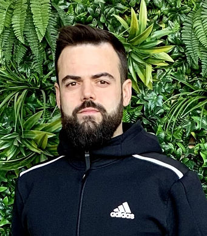
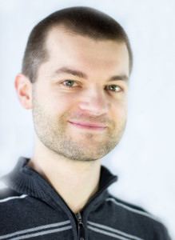
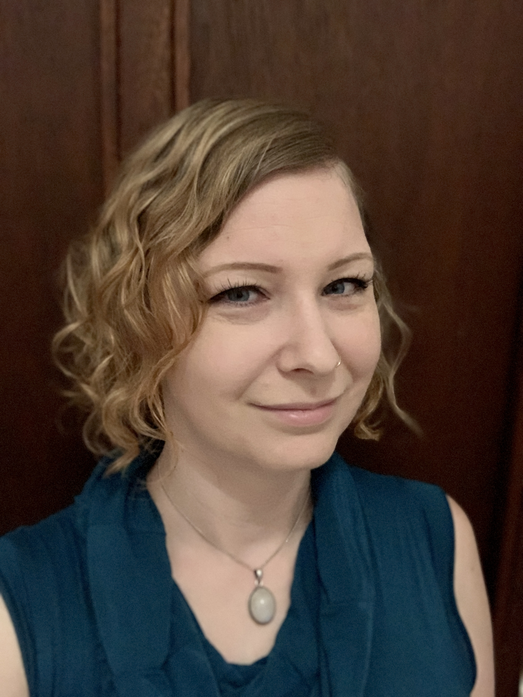
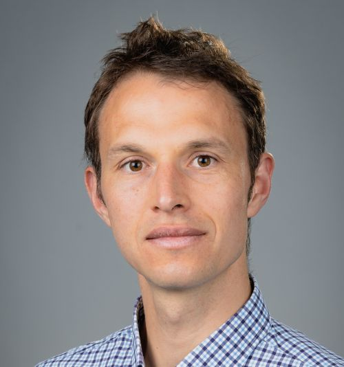
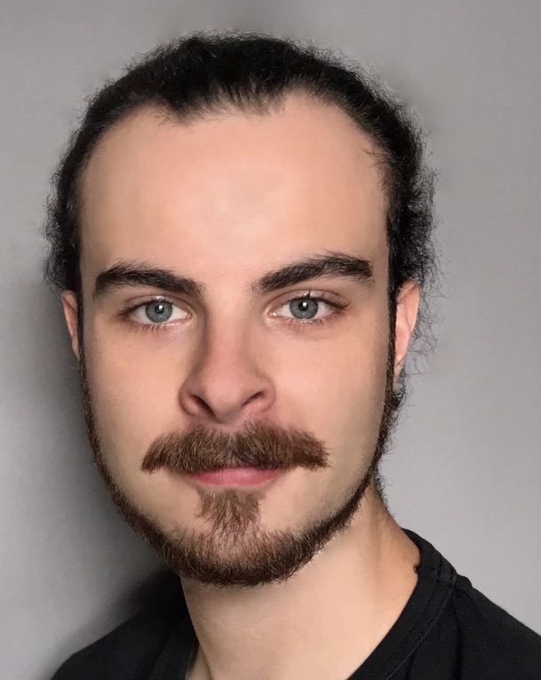

# Community

STACK has a very active user base in different roles. The easiest way to engage with the community is through our <a href="https://stack-assessment.zulipchat.com/">free online chat platform</a>. All kinds of questions, suggestions and comments are welcome there!

## Development team

Continuously developed and used since 2004.

 

	

		

			 
			<h4>Chris Sangwin</h4>
			

				The University of Edinburgh, UK 
				<a href="mailto:C.J.Sangwin@ed.ac.uk">C.J.Sangwin@ed.ac.uk</a> 
				<em>Chairperson of the International Advisory Board</em>
			

		

    

	

		

			 
			<h4>Tim Hunt</h4>
			
The Open University, UK

		

		

			 
			<h4>Matti Harjula</h4>
			
Aalto, Finland

		

		

			 
			<h4>Jesús Copado</h4>
			

				SURLABS 
				<a href="mailto:jcopado@surlabs.es">jcopado@surlabs.es</a> 
				<em>STACK for ILIAS developer and Service Provider</em>
			

		

	

## STACK International Advisory Board

The International Advisory Board encourages engagement from the community of users of the STACK
online assessment system and helps to oversee strategic developments of
the system. The Advisory Board promotes the long-term stainability of the software and invites
contributions from diverse stakeholders.

 

	

    

    	

 
    	<h4>Meike Akveld</h4>
    	
ETH Zürich <a href="mailto:akveld@math.ethz.ch">akveld@math.ethz.ch</a> <em></em>

    

    

    	

 
    	<h4>Ian Jones</h4>
    	
Department of Mathematics Education, Loughborough University <a href="mailto:I.Jones@lboro.ac.uk">I.Jones@lboro.ac.uk</a> <em></em>

    

    

    	

 
    	<h4>David Stern</h4>
    	
IDEMS International <a href="mailto:d.a.stern@idems.international">d.a.stern@idems.international</a> <em></em>

    

  

	

    

    	

 
    	<h4>Michael Obiero Oyengo</h4>
    	
Masseno University, Kenya <a href="mailto:obiero@maseno.ac.ke">obiero@maseno.ac.ke</a> <em></em>

    

    

    	

 
    	<h4>Antti Rasila</h4>
    	
Guangdong Technion-Israel Institute of Technology <a href="mailto:antti.rasila@gtiit.edu.cn">antti.rasila@gtiit.edu.cn</a> <em>Founder of the Abacus Consortium</em>

    

    

    	

 
    	<h4>Morten Brekke</h4>
    	
University of Agder <a href="mailto:morten.brekke@uia.no">morten.brekke@uia.no</a>

    

  

	

    

    	

 
    	<h4>Tim.Lowe</h4>
    	
The Open University, UK <a href="mailto:tim.lowe@open.ac.uk">tim.lowe@open.ac.uk</a> <em></em>

    

    

    	

 
    	<h4>Michael Weinmann</h4>
    	
Ostbayerische Technische Hochschule (OTH) Amberg-Weiden <a href="mailto:m.weinmann@oth-aw.de">m.weinmann@oth-aw.de</a> <em></em>

        
<em>Chairperson of the 2024 conference</em>

    

    

    	

 
    	<h4>Katja Dechant-Herrera</h4>
    	
Ostbayerische Technische Hochschule (OTH) Amberg-Weiden <a href="mailto:k.dechant@oth-aw.de">k.dechant@oth-aw.de</a> <em></em>

    

  

	

    

    	

 
    	<h4>Oksana Labanova</h4>
    	
TTK University of Applied Sciences <a href="mailto:oksana.labanova@tktk.ee">oksana.labanova@tktk.ee</a> <em>Chairperson of the 2023 conference</em>

    

    

    	

 
    	<h4>Michael Kallweit</h4>
    	
Ruhr-Universität Bochum <a href="mailto:michael.kallweit@rub.de">michael.kallweit@rub.de</a>

    

    

## STACK Professionals Network

The STACK Professionals Network was established during the summer of 2022 to bring together early career professionals (not necessarily academics), across various institutions, who spend a significant amount of their time authoring STACK questions. Authoring STACK questions requires specialist skills, and the people who do this job somtimes work in relative isolation in their institutions. They may not have much help regarding various issues that they encounter authoring questions. The Network will help the STACK professionals to solve various authoring difficulties and also make it easier to share existing questions/quizzes. Furthermore, the Network can provide training to colleagues who are new into STACK and define the pedagogy around creating STACK questions.

To join the Network come in contact with Chris Sangwin: <a href="mailto:c.j.sangwin@ed.ac.uk">c.j.sangwin@ed.ac.uk</a> or Konstantina Zerva: <a href="mailto:k.zerva@ed.ac.uk">k.zerva@ed.ac.uk</a>.

To contact the Network: <a href="mailto:network_stack_prof@mlist.is.ed.ac.uk">network_stack_prof@mlist.is.ed.ac.uk</a>.

	

    

    	

 
    	<h4>Konstantina Zerva</h4>
    	
The University of Edinburgh, UK <a href="mailto:k.zerva@ed.ac.uk">k.zerva@ed.ac.uk</a> <em></em>

    

    

    	

 
    	<h4>George-Ionut Ionita</h4>
    	
ETH Zürich <a href="mailto:georgeionut.ionita@math.ethz.ch">georgeionut.ionita@math.ethz.ch</a> <em></em>

    

    

    	

 
    	<h4>Andreas Steiger</h4>
    	
ETH Zürich <a href="mailto:andreas.steiger@math.ethz.ch">andreas.steiger@math.ethz.ch</a> <em></em>

    

  

	

    

    	

 
    	<h4>Maciej Matuszewski</h4>
    	
Durham University, UK <a href="mailto:m.t.matuszewski@durham.ac.uk">m.t.matuszewski@durham.ac.uk</a> <em></em>

    

	

    	

 
    	<h4>Sam Fearn</h4>
    	
Durham University, UK <a href="mailto:s.m.fearn@durham.ac.uk">s.m.fearn@durham.ac.uk</a> <em></em>

    

	

    	

 
    	<h4>Santiago Borio</h4>
    	
IDEMS International, UK <a href="mailto:smborio@idems.international">smborio@idems.international</a> <em></em>

    

    

	

		

    	

 
    	<h4>Georg Osang</h4>
    	
IDEMS International, UK <a href="mailto:gosang@idems.international">gosang@idems.international</a> <em></em>

    

	

    	

 
    	<h4>Kinga Sipos</h4>
    	
Bern University, Switzerland  <a href="kinga.sipos@unibe.ch">kinga.sipos@unibe.ch</a> <em></em>

    

		

    	

 
    	<h4>Luke Longworth</h4>
    	
University of Canterbury, New Zealand <a href="mailto:luke.longworth@canterbury.ac.nz">luke.longworth@canterbury.ac.nz</a> <em></em>

    

	

	

	

    	

 
    	<h4>Speedy Jiang</h4>
    	
University of Canterbury, New Zealand <a href="mailto:speedy.jiang@canterbury.ac.nz">speedy.jiang@canterbury.ac.nz</a> <em></em>

    

	

    	

 
    	<h4>Ruth Reynolds</h4>
    	
University College London, UK <a href="mailto:ruth.reynolds@ucl.ac.uk">ruth.reynolds@ucl.ac.uk</a> <em></em>

    

	

    	

 
    	<h4>Stephen Nulty</h4>
    	
National University of Ireland Maynooth, Ireland <a href="mailto:Stephen.Nulty@mu.ie">Stephen.Nulty@mu.ie</a> <em></em>

    

	

	

	

    	

 
    	<h4>Markus Orthaber</h4>
    	
Montanuniversität Leoben, Austria <a href="mailto:markus.orthaber@unileoben.ac.at">markus.orthaber@unileoben.ac.at</a> <em></em>

    

	

    	

 
    	<h4>Stefanie Zegowitz</h4>
    	
TU Clausthal, Germany <a href="zegowitz@rz.tu-clausthal.de">zegowitz@rz.tu-clausthal.de</a> <em></em>

    

	

    	

 
    	<h4>Chris Nelson</h4>
    	
The Open University, UK <a href="chris.nelson@open.ac.uk">chris.nelson@open.ac.uk</a> <em></em>

	

	

	

	

    	

 
    	<h4>Juma Zevick</h4>
    	
IDEMS International, Kenya <a href="mailto:jumazevick@gmail.com">jumazevick@gmail.com</a> <em></em>

    

	

    	

 
    	<h4>Alex Fowler</h4>
    	
The University of Otago, New Zealand <a href="mailto:alex.fowler@otago.ac.nz">alex.fowler@otago.ac.nz</a> <em></em>

    

	

    	

 
    	<h4>Jonas Lache</h4>
    	
Hochschule Ruhr West and Ruhr-Universität Bochum, Germany <a href="mailto:jonas.lache@hs-ruhrwest.de">jonas.lache@hs-ruhrwest.de</a> <em></em>

    

	

