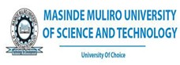

# African STACK Conference for Undergraduate Mathematics

The first African STACK Conference for Undergraduate Mathematics will take place at <a href="https://www.mmust.ac.ke" target="blank">Masinde Muliro University of Science and Technology (MMUST)</a> from 19 to 23 June 2023.

The conference aims to enable African educators with experience on STACK to define a roadmap for transformation of African maths education. Since 2019, African universities started incorporating STACK assessments to their undergraduate courses, particularly to deal with issues of large class sizes (some classes are over 1,200 students) with a single lecturer and no additional human resources. A concerted effort was started by groups of universities, with the support of <a href="https://www.idems.international/" target="blank">IDEMS International</a>, to promote STACK in the region through open resources and question banks, which are slowly spreading throughout the continent, with the objective of full curriculum coverage.

The conference will provide a platform for lecturers to present their experiences incorporating STACK to undergraduate courses, their methodologies and impact found. Key stakeholders will have an opportunity to extend their collaboration and accelerate the integration of STACK.

The conference will include a 2-day STACK workshop, 2 days of paper and poster presentations, and a final day roundtable discussion with key stakeholders or an additional workshop.

## Registration is now open

Please fill in the registration form below to attend the conference. We will write to you shortly after receiving your application with payment details.

Limited funding may be available for partial or full waivers and financial support for additional expenses. Due to limited funding this will only be possible in exceptional circumstances and places at the conference are not guaranteed if support is requested. Decisions will be made on a case-by-case basis. If you require financial support to attend the conference, please submit your registration form no later than 8th May 2023.

### Fees

* For Kenyan participants: KES15,000 (a KES5,000 discount is available for Kenya Mathematical Society members)
* For other African participants: USD150
* For other international participants: USD300

<a class="btn btn-primary btn-lg" href="https://docs.google.com/forms/d/e/1FAIpQLSdnS7EgQ0fUyzoRs_q7s25YqE_r8073usF_Zv2JSIUYJavYew/viewform?usp=sf_link" role="button">Register Now</a>

## Submit an abstract 

The conference will include a combination of 30-minutes Paper Presentations and 15-minutes Poster Presentations. Please submit an abstract (maximum 4000 characters) in the form below. The final deadline for submissions has been extended to 14th May 2023.

<a class="btn btn-primary btn-lg" href="https://docs.google.com/forms/d/e/1FAIpQLScXWJiT-mxuJuVfCDApc6-9sRqdgoWeDhXF4wAGN--FqBlSRw/viewform?usp=sf_link" role="button">Submit an Abstract</a>

## Keynote Speakers

* Prof Chris Sangwin, The University of Edinburgh, Chairperson of the STACK International Advisory Board
* Prof George Lawi, Masinde Muliro University for Science and Technology
* Dr David Stern, IDEMS International, member of the STACK International Advisory Board
* Dr Michael Obiero Oyengo, Maseno University, Kenya, member of the STACK International Advisory Board and vice-chair of the Kenya Mathematical Society
* Dr James Kaleli Musyoka, Maseno University, Kenya, vice-president of the International Association for Statistics Education

## Confirmed Invited Speakers

* Dr Idrissa Said Amour, University of Dar es Salaam, Tanzania
* Dr Abdu Mohammed Seid, Bahir Dar University, Ethiopia
* Mr Santiago Borio, IDEMS International
* Dr Jared Ongaro, University of Nairobi, Kenya
* Dr Mary Ochieng, Strathmore University, Kenya
* Dr Donnie Kasyoki Munyao, Maseno University, Kenya
* Mr Juma Zevick, IDEMS International
* Mr Wastalas Montognon, IDEMS International
* Dr Danilo Lewanski, University of Trieste, Italy, Université de Genève, Switzerland, SAMI

## Organising Committee

* Prof George Lawi (MMUST)
* Dr Achiles Nyongesa (MMUST)
* Dr Everlyne Odero (MMUST)
* Dr Frankline Tireito (MMUST)
* Dr. David Angwenyi (MMUST)
* Mr Santiago Borio (IDEMS International)
* Dr Michael Obiero (Maseno University)
* Ms Christine Laetitia (INNODEMS)
* Mr Juma Zevick (IDEMS International)
* Dr Danilo Lewanski (University of Trieste, Université de Genève, SAMI)

## Supported by

   

      

         
 
         <h4>MMUST</h4>

      

      

         
 
         <h4>Maseno University</h4>

      

      

         
 
         <h4>Kenya Mathematical Society</h4>

      

   

    
   

      

         
 
         <h4>IDEMS International</h4>

      

      

         
 
         <h4>INNODEMS</h4>

      

      

         
 
         <h4>SAMI</h4>

      

   

      

      

         
 
         <h4>Swiss National Science Foundation</h4>

      

      

         
 
         <h4>Université de Genève</h4>

      

      

         
 
         <h4>European Mathematical Society</h4>

      

   

