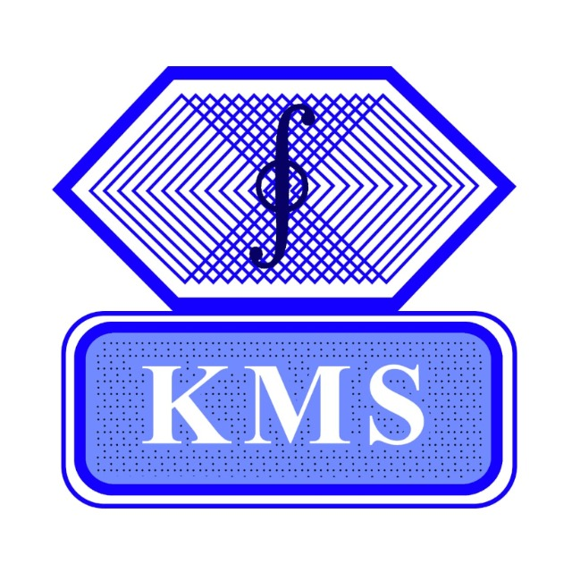

# African STACK Conference for Undergraduate Mathematics

The first African STACK Conference for Undergraduate Mathematics will take place at <a href="https://www.mmust.ac.ke" target="blank">Masinde Muliro University of Science and Technology (MMUST)</a> from 19 to 23 June 2023.

The conference aims to enable African educators with experience on STACK to define a roadmap for transformation of African maths education. Since 2019, African universities started incorporating STACK assessments to their undergraduate courses, particularly to deal with issues of large class sizes (some classes are over 1,200 students) with a single lecturer and no additional human resources. A concerted effort was started by groups of universities, with the support of <a href="https://www.idems.international/" target="blank">IDEMS International</a>, to promote STACK in the region through open resources and question banks, which are slowly spreading throughout the continent, with the objective of full curriculum coverage.

The conference will provide a platform for lecturers to present their experiences incorporating STACK to undergraduate courses, their methodologies and impact found. Key stakeholders will have an opportunity to extend their collaboration and accelerate the integration of STACK.

The conference will include a 2-day STACK workshop, 2 days of paper presentations and discussions, and a final day roundtable discussion with key stakeholders.

## Register Your Interest

Details on how to submit a presentation will be published soon. To keep updated with details about the conference, please <a href="https://docs.google.com/forms/d/e/1FAIpQLScHm7-IkF62eckxk3Li8O50B_WCHQJPsGWBCkIwiWHcB6pLug/viewform?usp=sf_link" target="blank">register your interest</a>.

## Fees

* For Kenyan participants: KES15,000 (a KES5,000 discount is available for Kenya Maths Society members)
* For other African participants: USD150
* For other international participants: USD300

## Invited Keynote Speakers
* Prof Chris Sangwin, The University of Edinburgh, Chairperson of the STACK International Advisory Board 
* Dr David Stern, IDEMS International, member of the STACK International Advisory Board
* Dr Michael Obiero Oyengo, Maseno University, Kenya, member of the STACK International Advisory Board and vice-chair of the Kenya Maths Society
* Dr James Kaleli Musyoka, Maseno University, Kenya, vice-president of the International Association for Statistics Education

## Confirmed Invited Speakers
* Prof George Lawi, MMUST
* Dr Idrissa Said Amour, University of Dar es Salaam, Tanzania
* Dr Abdu Mohammed Seid, Bahir Dar University, Ethiopia
* Dr Georg Osang, IDEMS International
* Mr Santiago Borio, IDEMS International

## Supported by
 

	

    

    	
 
    	<h4>MMUST</h4>

    

    

    	
 
    	<h4>Maseno University</h4>

    

        

    	
 
    	<h4>Kenya Maths Society</h4>

    

    

    
    

    

    	
 
    	<h4>IDEMS International</h4>

    

    

    	
 
    	<h4>INNODEMS</h4>

    

    

    	
 
    	<h4>SAMI</h4>

    

    

    

