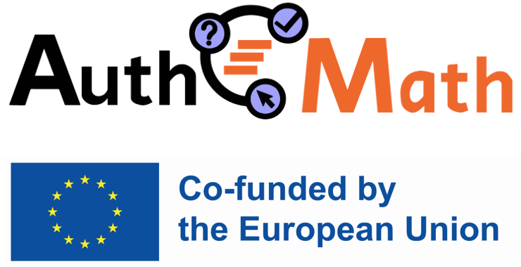

# Discovering AuthOMath

The AuthOMath project [https://www.authomath.org/](https://www.authomath.org/), supported by the European Union’s Erasmus+ programme, has dedicated two and a half years to integrating GeoGebra and STACK. Its primary aim is to provide teaching guidelines for designing dynamic mathematical tasks with tailored feedback for students' errors.

To present the achievements achieved by researchers from Heidelberg University of Education (Germany), the University of Edinburgh (Scotland), Johannes Kepler University (Austria), and the University of Cantabria, the Discovering AuthOMath (Descubriendo AuthOMath) event is organized at the Faculty of Sciences of the University of Cantabria. This event will offer insights into innovative teaching approaches and practical applications for secondary and tertiary education mathematics teachers.

**When:** 8 May 2024

**Where:** Faculty of Sciences, University of Cantabria, Santander, Cantabria, Spain.

### Speakers

* José Manuel Diego Mantecón (Universidad de Cantabria)
* Camilo Sua (Universidad de Valencia)
* María Sanz-Ruiz (Universidad de Cantabria)

Further information about the program can be found at the following link: [https://www.authomath.org/?p=2065](https://www.authomath.org/?p=2065).

### Sign up

Please register using this form by May 3, 2024: [https://www.authomath.org/](https://www.authomath.org/?page_id=2044)

<table>
<tr>
<td></td>
<td align="left">The project is co-funded by the EU under the Erasmus+ Programme No. 2021-1-DE01-KA220-HED-000032031</td>
<td>
</tr>
</table>
