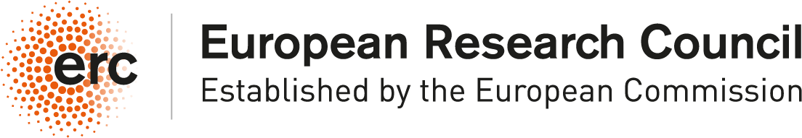

# The 2nd African STACK Conference for Undergraduate Mathematics

The 2nd African STACK Conference for Undergraduate Mathematics  will be held at the <a href="https://tukenya.ac.ke/" target="_blank">Technical University of Kenya</a> (TUK) from 12th to 16th  August 2024.

The conference aims to bridge the gap between Mathematics educators with experience and access to STACK resources and the pressing need for support in teaching and formative assessment with immediate feedback in mathematics within African universities. With the establishment of the African STACK Community Leadership Team and access to IDEMS’ Open Question Banks (OQB) of STACK questions, there is the potential for widespread adoption and institutionalization of STACK for continuous assessment with timely feedback across African institutions, which has been a universal challenge in these contexts.

The conference also aims to open avenues for collaboration with international partners in conducting research and evaluation, particularly on the effectiveness of digital interventions in assessment in low-resource environments. Large class sizes and growing adoption of STACK in undergraduate courses in the region has proven to be a rich source of data for analysis.

Africa is uniquely positioned to lead in the large-scale adoption of digital technologies for formative assessment of undergraduate mathematics. The conference will serve as a platform for lecturers to share their experiences incorporating STACK into undergraduate courses, including their methodologies and observed impacts. Lecturers who have utilized STACK in their teaching will also have the opportunity to present their courses for peer review and engage in discussions on their work. Additionally, other participants will have the opportunity to share their STACK work, which will help define strategies for improved STACK integration in African institutions.

## Conference Format

The conference will include 2-days of STACK workshop, 2 days of paper presentations, and a final day roundtable discussion with key stakeholders or an additional workshop, and a panel discussion with key stakeholders. Workshops will offer opportunities to develop, improve and analyze courses delivered with STACK integration with the objective of lecturers leaving the conference with courses they can directly deliver.

## Submission of Abstracts is now open

Paper presentations at the conference will serve as a platform to share experience of STACK integration in African universities and educational institutions, share key STACK features that could serve the community, promote the STACK research agenda, within several other purposes. We welcome presentations from STACK users off all type, from developers, through lecturers using STACK, to STACK professionals.

Please submit an abstract (maximum 4000 characters) in the form below. The deadline for submissions is Sunday 7th July at 23:59 East Africa Time.

<a class="btn btn-primary btn-lg" href="https://docs.google.com/forms/d/e/1FAIpQLSdC5ruwR7xF_Y2EPDKVz0Xxyx_LzINbmBtuHZZ9Zmqa3oPxUg/viewform?usp=sf_link" target="_blank" role="button">Submit an Abstract</a>

## Registration is now open

Please register to participate in the conference by filling in the registration form below. The organizing committee will write to you shortly after receiving your application with payment details.

Limited funding may be available for partial or full waivers and financial support for additional expenses. Due to limited funding this will only be possible in exceptional circumstances and places at the conference are not guaranteed if support is requested. Decisions will be made on a case-by-case basis. If you require financial support to attend the conference, please submit your registration form no later than Monday 1st July 2024.

### Fees

* Kenyan participants: KES20,000 (a KES5,000 discount is available for Kenya Mathematical Society members)
* Other African participants: USD150
* Other international participants: USD300
* African Postgraduate Students: USD50

<a class="btn btn-primary btn-lg" href="https://docs.google.com/forms/d/e/1FAIpQLSdViun6myIOPOKw-mSXI9-6wuofc2gUBzYpoPQC_xuXVp79gQ/viewform?usp=sf_link" target="_blank" role="button">Register Now</a>

## Submit an abstract 

Information on how to submit an abstract for presentations will be published soon, together with relevant deadlines.

<!-- 

<a class="btn btn-primary btn-lg" href="https://docs.google.com/forms/d/e/1FAIpQLScXWJiT-mxuJuVfCDApc6-9sRqdgoWeDhXF4wAGN--FqBlSRw/viewform?usp=sf_link" role="button">Submit an Abstract</a>

 -->

## Keynote Speakers

* Prof Chris Sangwin, The University of Edinburgh, Chairperson of the STACK International Advisory Board
* Dr Michael Obiero Oyengo, Maseno University, Kenya, member of the STACK International Advisory Board, vice-chair of the Kenya Mathematical Society, and chair of the African STACK Community Leadership Team
* Dr Beth Nyambura Kiratu, Technical University of Kenya, Treasurer of the Kenya Mathematical Society (TBC)
* Dr David Stern, IDEMS International, member of the STACK International Advisory Board, and Dr Franca Hoffmann, California Institute of Technology (Caltech), US, International Scientific Advisor at Quantum Leap Africa, at the African Institute for Mathematical Sciences (AIMS)
* Dr Mary Achieng Ochieng, Strathmore University, Kenya, member of the African STACK Community Leadership team.

## Organising Committee

### Host organisers (TUK)

* Dr Beth Nyambura Kiratu
* Dr Ben Obiero
* Dr Esther Njue
* Dr Catherine Mwangi

### Supporting Organisers

* Dr Michael Obiero Oyengo, Maseno University, Kenya
* Dr Mary Achieng Ochieng, Strathmore University, Kenya
* Prof George Lawi, Masinde Muliro Uinversity of Science and Technology, Kenya
* Dr Idrissa Said Amour - University of Dar es Salaam, Tanzania
* Mr Santiago Borio, IDEMS International, UK
* Prof Bertrand Eynard, IPhT, Université Paris-Saclay, France
* Dr Danilo Lewański, University of Trieste, Italy

## Supported by

   

      

         
 
         <h4>Technical University of Kenya</h4>

      

      

         
 
         <h4>Maseno University</h4>

      

      

         
 
         <h4>Kenya Mathematical Society</h4>

      

   

    
   

      

         
 
         <h4>IDEMS International</h4>

      

      

         
 
         <h4>INNODEMS</h4>

      

      

         
 
         <h4>SAMI</h4>

      

   

   

      

         
 
         <h4>MMUST</h4>

      

      

         
 
         <h4>European Research Council</h4>

      

      

         
 
         <h4>Institut de Physique Theorique</h4>

      

   

   

      

         
 
         <h4>Centre National de la Recherche Scientifique</h4>

      

      

         
 
         <h4>Centre d’Energie Atomique</h4>

      

   

