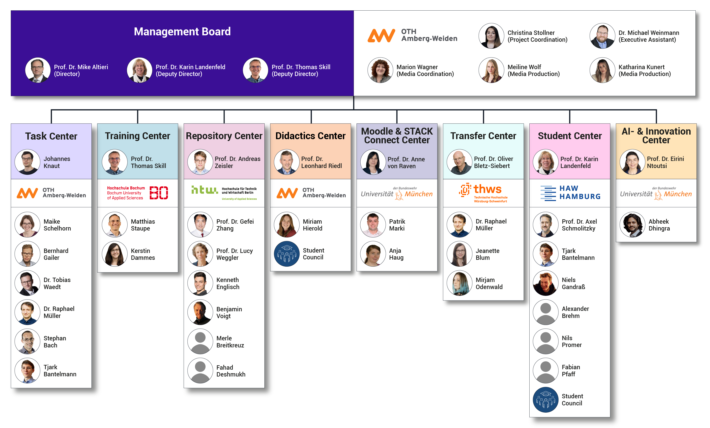

## German Center for Digital Tasks

Start date: 01.10.2025 
End date: 31.12.2029

__Official project website:__ [https://dzda.info/](https://dzda.info/)

The germany-wide collaborative STACK-project named “DZdA” (German Center for Digital Tasks) provides several services to make it as easy as possible for lecturers to use high-quality STACK questions at German universities. The project DZdA is a collaboration between six universities in Germany with eight different task-specific centers. The project is led by Prof. Mike Altieri at OTH Amberg-Weiden. Its goal is to provide, tutor and foster high-quality STACK questions. The project is funded from 10/2025 until 12/2029 with a possibility of continued funding until 12/2031 after successful evaluation.

### On-demand Question Authoring and other services

As one key element, the DZdA project provides a custom on-demand STACK question authoring service from experts in question authoring. Additionally, the DZdA offers workshops and training sessions for STACK. The project develops a taxonomy for STACK tasks and quality standards and the project adapts the questions to meet these standards. The project aims to strengthen the STACK community by initiating a network amongst practitioners and researchers on STACK use and by building a Moodle infrastructure for students and lecturers to use STACK who do not have access to STACK at their own university. Another milestone of DZdA is to provide access to high-quality didactically processed and continuously maintained STACK tasks in a repository in German and English with an easy access to the repository for users.

 

The project DZdA is funded by the German Foundation for Innovation in Higher Education. For more information visit https://dzda.info or contact us via email: dzda@oth-aw.de 