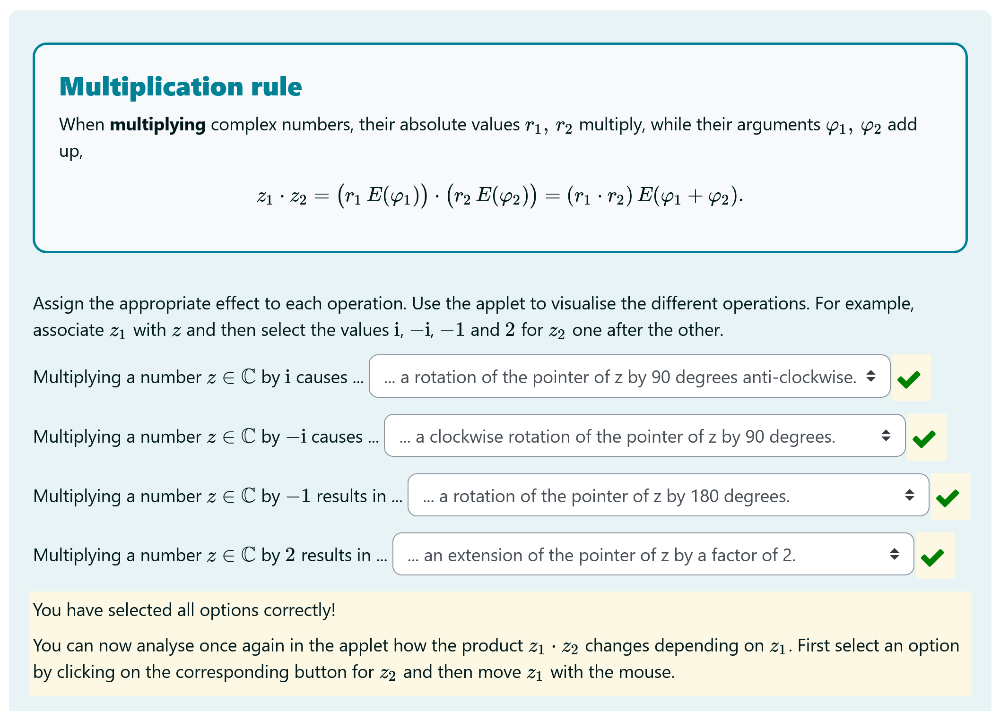

# IdeaL – Innovation Network for Digital Adaptive Lesson

Start date: 01/08/2021 
End date: 31/12/2025 
Duration: 53 months

__Official project website:__ [https://www.oth-aw.de/ideal](https://www.oth-aw.de/ideal)

The IdeaL project set up an innovation network in which flexible learning modules for adaptive digital teaching are developed and produced.  Among other **project objectives**, such as the development of innovative learning spaces, IdeaL also includes two fields where STACK plays an important role: first, interactive self-learning modules for engineering mathematics, and second, the service center for digital exercises.

The goal of the **service center for digital exercises** is to facilitate and promote the use of e-assessment across faculties. Therefore, a team of STACK developers works together with lecturers to create STACK questions for online quizzes in moodle. One of the main goals is to convince lecturers to include online assessment in their courses without resulting in an increased workload or the need for intermediate programming skills. Positive feedback from lecturers in the early stages of the service center reinforced the team to focus primarily on STACK due to the possibilities for providing detailed feedback and also to include interactive applets. The work of the service center resulted in numerous STACK questions used for various subjects. Especially for lectures in electrical engineering, many STACK questions including interactive applets have been developed.

The IdeaL project team is also developing **interactive self-learning modules** for different topics of engineering mathematics such as linear algebra, complex numbers, or differential calculus. These modules are implemented as moodle courses and provide students with an additional possibility to learn and practice. This is especially helpful for students who begin their studies in summer term and thus have to catch up on topics from the first semester without having a traditional lecture. But the self-learning modules also aim at students who just need additional practice or repetition.

STACK plays an integral role in these self-learning modules. They consist of interactive chapters, in which STACK questions are not only used for practice but also to engage with new content. The chapters are accompanied by a set of practice tasks, which are all implemented using STACK. STACK is thus used both for classical assessment in the practice tasks as well as for interactive elaboration of mathematical topics in the chapters. To illustrate these two aspects, one STACK question each from the interactive chapters and the practice quiz is introduced below. The questions are part of the self-learning module on complex numbers.

The first example is a **question from the elaboration phase** on the multiplication rule, i.e. from an interactive chapter. It is divided into three parts. First, the formula for the multiplication of complex numbers is given. Second, students are asked to complete statements on the geometric interpretation of multiplications involving complex numbers using dropdown menus. And third, students have the opportunity to explore the geometric representation in an interactive JSXGraph applet. As stated above, STACK is not primarily used for classical online assessment here, but to enhance engagement with new topics. The possibility to provide detailed feedback based on students' answers supports this goal, as students can answer the questions multiple times and use the feedback to revise their answers.

    <figure class="figure">
        
        <figcaption class="figure-caption">First part of the presented STACK question containing a description of the multiplication rule alongside multiple dropdown inputs for learners to complete sentences about the multiplication between complex numbers</figcaption>
    </figure>

    <figure class="figure">
        
        <figcaption class="figure-caption">Second part of the question containing an interactive applet with buttons to play animations of different geometric operations</figcaption>
    </figure>

STACK questions are also used in **practice quizzes** where the main goal is to provide a range of tasks with different difficulty levels for students to practise what they have learned in the interactive chapters. Here, students also have unlimited tries and can check their answers. In the example question shown below, student are asked to perform arithmetic operations such as subtraction or division on complex numbers. STACK provides the possibility to give dedicated feedback for partially correct or incorrect answers (for instance if the resulting complex number is correct but not simplified, students receive feedback that the answer is algebraically equivalent but not in the correct form). In some cases, additional feedback is given for correct answers explaining important concepts or pointing out connections between topics. After submitting the practice quiz, worked solutions are shown using the general feedback.

    <figure class="figure">
        
        <figcaption class="figure-caption">A STACK question from the practice tasks that asks learners to perform arithmetical operations with a given complex number</figcaption>
    </figure>

Overall, STACK plays an important role in the IdeaL project because of the possibility to provide interactive and adaptive online learning materials for students.

The project IdeaL is **funded by** the German Foundation for Innovation in Higher Education. For more information visit <https://www.oth-aw.de/ideal> or contact us via email: [Prof. Mike Altieri](mailto:m.altieri@oth-aw.de).

 

