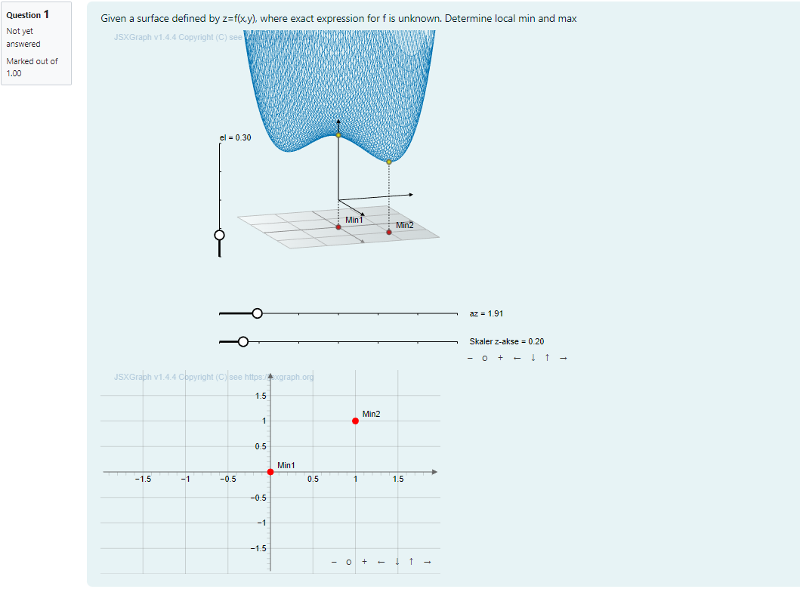

# IDIAM: Interactive digital assessment in mathematics

Start date: 01/07/2021 
End date: 01/07/2023  
Total duration: 24 months

The project responded to challenges faced during COVID-19 by helping partner institutions use STACK to develop a) digital tools that assess competencies within science, technology, engineering and mathematics (STEM), particularly mathematical sciences
and b) digital assignments within several specific mathematical subjects at the partner institutions.

Based on the STACK system, the project aimed at development of a) digital tools that assess competencies within science, technology, engineering and mathematics (STEM), particularly mathematical sciences
and b) digital assignments within several specific mathematical subjects at the partner institutions.

Outcomes from this project include

1. Release digital interactive problems in STACK for the course [Fundamentals of Algebra and Calculus](../../CaseStudies/2019/FAC/) and for [HELM](../../CaseStudies/2021/HELM/)
2. Example problems in multivariate analysis, that actively use interactive 3D-graphics to illustrate mathematical concepts within multivariate analysis. 3D graphics will be also
used to assess student's knowledge of multivariate analysis.
3. A plugin to STACK/Moodle that makes it possible to plot interactive mathematical 3D graphics.
4. Didactic studies showing how to work with several representation forms for complex mathematical concepts, such as functions, to facilitate better understanding.

Project partners

* Norges Teknisk-Naturvitenskapelige Universitet Ntnu, Norway
* The University Of Edinburgh, UK
* Friedrich-Alexander-Universität Erlangennürnberg, Germany 
* Ruhr-Universitaet Bochum, Germany

## Example outcomes

* HELM materials are released through the project [github page, sample questions](https://github.com/maths/moodle-qtype_stack/tree/master/samplequestions) folder.  Download the `HELM_Sept_23.mbz` Moodle backup file for the collection of HELM materials released through this project.
* For the JSXGraph part of the project [example outcomes](https://idiamath.github.io/) were released through their own [github site](https://github.com/IDIAMath/idiamath.github.io/blob/master/docs/index.md).  In partcular the project was key in developing further [documentation](https://docs.stack-assessment.org/en/Authoring/JSXGraph/) for the JSXGraph-STACK connection.

__Example__ Given a plot of a function \(f(x,y)\) in two variables, ask the student to select all local maxima/minima by clicking on the plot itself. The algebraic expression for
is not given to the student.

The motivation behind this question is to help the student to get familiar with surfaceplots, multivariable functions and points of interest in such plots and functions. Currently we only ask the student to identify local maxima and minima, but the question could be adapted to also ask for saddlepoints, global and local extremas and so forth.

<table>
<tr>
<td></td>
<td align="left"></td>
<td>
</tr>
</table>
