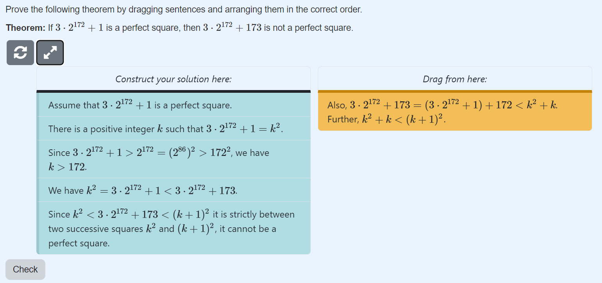
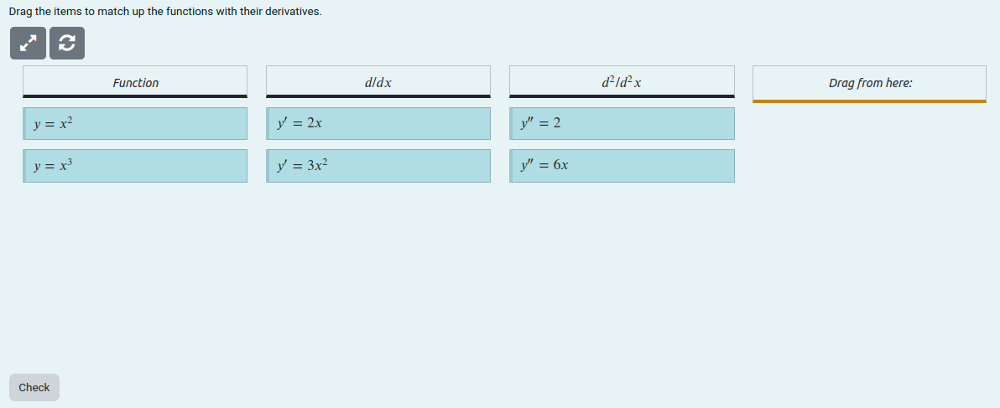
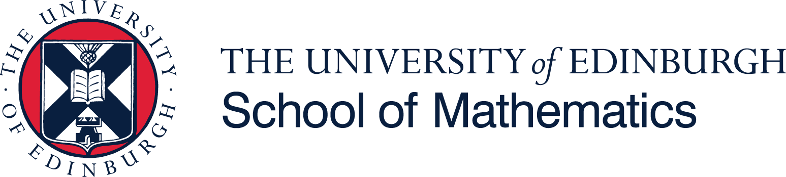

# KTP: Knowledge Transfer Partnership for Digital Mathematics Assessment

Start date: 08/09/2023 
End date: 31/08/2025  
Total duration: 24 months  
Project partners: The University of Edinburgh & IDEMS International  
Funded by: Innovate UK

## Project Aims

This two-year project, funded by [Innovate UK](https://www.ukri.org/councils/innovate-uk/), is a collaboration between the [School of Mathematics](https://www.maths.ed.ac.uk/school-of-mathematics) at the University of Edinburgh and [IDEMS International](https://www.idems.international/). The project focuses on two main workstreams which both aim to enhance STACK as follows. 

1. Develop features to improve the assessment of proof-based questions in STACK.
2. Optimise STACK so that it can be used in broader contexts, for example statistics and data science.

Alongside the above two core aims, the project also involves the continuous addition of smaller-scale features and general code-base maintenance, which aims to improve the user experience in STACK.

## Background

### Proof

Mathematical proof forms the core of an undergraduate degree in mathematics. While STACK was originally designed for reasoning within algebraic equivalences, it has grown to encompass numerous aspects of mathematics.
However it remains difficult to assess text-based proof questions. 
One of the main aims of the project is to address this, by adding features that can not only allow STACK to automate assessment of proof questions but also facilitate new avenues in which both students and authors can interact with and understand mathematical proof.

### Statistics 

In recent years STACK has seen broader applications, with it being used by members of the STACK Professionals Network and IDEMS International to write questions for statistics and data science. 
Questions in these fields typically require the student to interact with and analyse datasets. 
One approach for writing such questions involves randomly generating a dataset which the student can then download.
As datasets grow, such processes understandably lead to system timeouts. 
Optimising the STACK codebase so that larger datasets can be processed is key to broadening its usage within statistics and data science.

## Outcomes 

The currently released project outcomes of the project include:

1. Release of the first version of the `parsons` question block in STACK v4.5.0 enabling author's to write Parson's problems for proof. See the [case study](../../CaseStudies/2024/Parsons.md) for details on the development of Parson's problems within STACK. Parson's problems require the student to drag and drop pre-written steps into the correct order in order to prove a given statement. General tools for generating specific line-by-line feedback and assessing non-unique answers are included. An example of the user interface and automated line-by-line feedback are displayed below.  
2. Release functionality for matching problems as a the second version of the `parsons` question block in STACK v4.6.0 ([Documentation](https://docs.stack-assessment.org/en/Topics/Matching/)). This block now supports more general layouts involving multiple columns and grids, which allow the student to drag items to specific groups or specific points on a grid. An example of a question in the grid layout is given below. 
3. Optimisations of the STACK code were released in v4.6.0, details [here](https://docs.stack-assessment.org/en/Developer/Optimising_STACK_for_large_Maxima_variables/), which saw processing speeds of up to 274 times faster when generating dummy datasets in a question.

## People

- <strong>[Sal Mercuri](https://www.maths.ed.ac.uk/~smercuri/)</strong>, Knowledge Transfer Associate, The University of Edinburgh & IDEMS International.
- <strong>[Chris Sangwin](https://www.maths.ed.ac.uk/~csangwin/)</strong>, Knowledge Base Supervisor, The University of Edinburgh.
- <strong>Santiago Borio</strong>, Company Base Supervisor, IDEMS International.
 
 

   

        

        
 

        

        

        
 

        

        

        
 

        

    

 