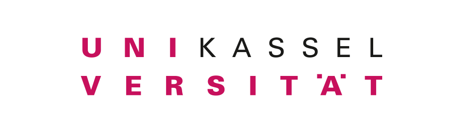
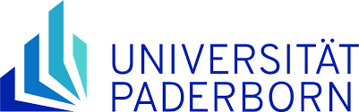
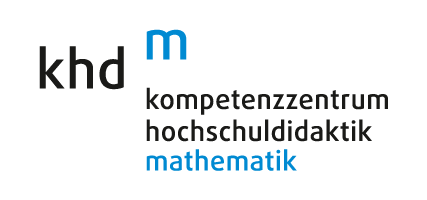
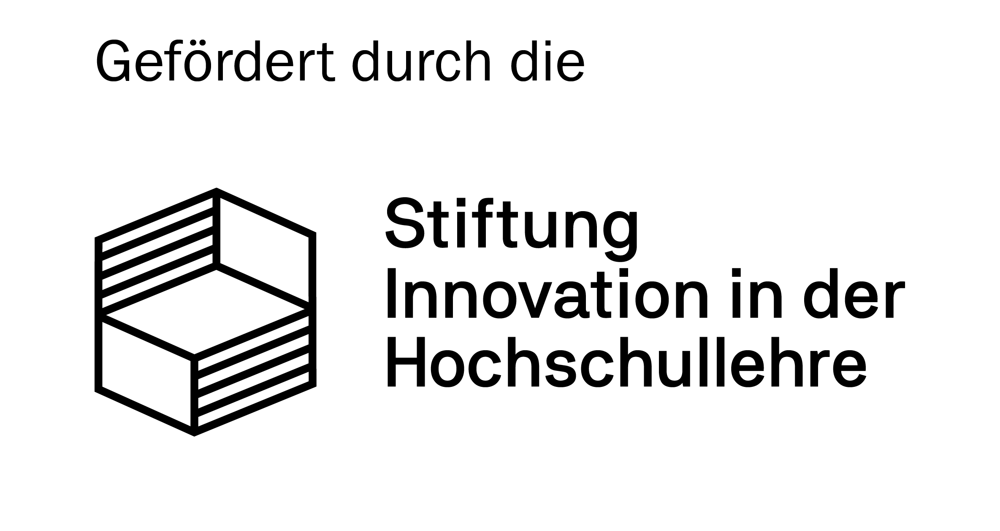

# LLV.HD - Providing digital learning materials for university teaching

  

    Start date: 01/08/2021 
    End date: 31/12/2025
  

  

 

**Goals of our project**  
The LLV.HD project aims to develop digital teaching-learning networks for blended learning formats in mathematics studies across German universities. Digital elements such as STACK tasks, explanatory videos, multiple choice quizzes, GeoGebra visualisations and podcasts are embedded in coherent didactic concepts and freely accessible [here](https://komo.uni-paderborn.de/course/view.php?id=317) in our Moodle course. 

**Integration and use of STACK tasks in university course**  
As part of the project, STACK tasks were developed mainly for analysis/calculus lectures in mathematics, engineering, economics and mathematics education degree programs. Most of these tasks have already been implemented and evaluated in teaching. Those evaluations were then used for improving the tasks and feedback. 

**Characteristics of our STACK tasks**  
The STACK tasks cover the following topics: Elementary set theory, elementary equalities and inequalities, sequences and limits, geometric series, computing derivatives, computing Taylor series, computing integrals and areas under curves, improper integrals, computing derivatives of multivariate functions.
Most of the tasks are randomized. We designed individualised feedback for more complex tasks while others provide the automatic STACK feedback. Our tasks have already been used in university teaching, evaluated, and subsequently improved.

**Partners and funding**  
The project partners are Paderborn University and University of Kassel. The project is part of the [khdm](https://www.khdm.de/en), a joint scientific institution of the universities of Hannover, Kassel and Paderborn, which has been active since 2010 in university mathematics didactics.
LLV.HD is funded by Stiftung Innovation in der Hochschullehre.

More information can be found in our [Moodle course](https://go.upb.de/unimathe).  
You can also contact [Prof. Andreas Eichler](mailto:eichler@mathematik.uni-kassel.de) or [Prof. Michael Liebendörfer](mailto:michael.liebendoerfer@math.upb.de).

 

